<div align="center">

# 🏗️ Detailed Design Document
## Automated Configuration Management Architecture


**Document Classification:** Technical Reference  
**Author:** Adrian Johnson | **Email:** [adrian207@gmail.com](mailto:adrian207@gmail.com)

</div>

---

## 📊 Executive Summary

> **This document provides the complete technical blueprint required to deploy the Automated Configuration Management Architecture across development, test, and production environments.**

Implementation teams will find environment-specific network designs, IP addressing schemes, server specifications, and working configuration examples that eliminate architectural ambiguity and accelerate deployment timelines from months to weeks.

### 🎯 What This Document Delivers

<table>
<tr>
<td width="20%">

**🌐 Networks**
- 🔗 L2/L3 diagrams
- 📡 VLAN isolation
- 🛡️ Firewall rules
- 🎯 IP addressing

</td>
<td width="20%">

**💻 Servers**
- 📊 Specs by tier
- 🗄️ Storage sizing
- 🔧 OS requirements
- ⚙️ CPU/Memory

</td>
<td width="20%">

**📜 Code Samples**
- 🏗️ Terraform IaC
- ⚙️ Ansible plays
- 🪟 DSC configs
- 🔐 Vault policies

</td>
<td width="20%">

**🔗 Integration**
- 🔌 API endpoints
- 🔑 Auth methods
- 📊 Data flows
- 🔒 TLS configs

</td>
<td width="20%">

**🌍 Environments**
- 💻 Dev (small)
- 🧪 Test (small)
- 🚀 Prod (medium)
- 📋 Drift prevention

</td>
</tr>
</table>

### 🏛️ Architecture Overview

**🎯 Three-Tier Design**:

```mermaid
graph TB
    subgraph "🎛️ Management Tier"
        A[🗄️ Terraform] -->|Provisions| B[⚙️ Ansible]
        B -->|Configures| C[🔐 Vault]
        C -->|Secrets| B
    end
    
    subgraph "📊 Monitoring Tier"
        D[📈 Prometheus] -->|Metrics| E[📊 Grafana]
        E -->|Alerts| F[🚨 AlertManager]
    end
    
    subgraph "💻 Node Tier"
        G[🐧 Linux Nodes]
        H[🪟 Windows Nodes]
    end
    
    B -->|Ansible| G
    B -->|DSC| H
    D -->|Scrape| G
    D -->|Scrape| H
    
    style A fill:#e1f5ff
    style C fill:#ffe1e1
    style E fill:#d4edda
```



### 🎯 Environment Strategy Summary

| Environment | Tier | Purpose | Data | Refresh |
|-------------|------|---------|------|---------|
| 💻 **Dev** | Small | Rapid iteration, unit testing | Synthetic | On-demand |
| 🧪 **Test/Staging** | Small | Integration testing, CI/CD | Anonymized | Weekly |
| 🚀 **Production** | Medium | Live workloads | Real production | N/A |

### 👥 Intended Audience

| Role | Primary Use |
|------|-------------|
| 🏗️ **Implementation Team** | Authoritative reference during deployment |
| 🔧 **Infrastructure Engineers** | Server provisioning and network configuration |
| 🔐 **Security Engineers** | Firewall rules, encryption, access controls |
| 🛠️ **Operations Team** | Production architecture for ongoing support |

---

## 1. Document Purpose

This Detailed Design Document (DDD) translates the high-level architecture specification into concrete, actionable implementation details. Every component, network segment, and configuration parameter is specified to enable predictable, repeatable deployments across all environments.

**Scope**: This document covers architecture for:
- Development Environment (Small Tier, Ansible-Native)
- Test/Staging Environment (Small Tier, Ansible-Native)  
- Production Environment (Medium Tier, Hybrid Pull Model)

**Out of Scope**: Application-specific configurations, managed node applications, end-user workstation management

---

## 2. Environment Overview

### 2.1 Environment Strategy

Our multi-environment approach ensures changes are thoroughly validated before reaching production while maintaining consistent architecture patterns that simplify operations.

| Environment | Purpose | Change Approval | Deployment Frequency | Architecture Model |
|-------------|---------|-----------------|---------------------|-------------------|
| **Development** | Development and initial testing | Automatic from feature branches | Continuous (multiple times daily) | Ansible-Native (Small Tier) |
| **Test/Staging** | Integration testing, UAT, performance testing | Approval from development lead | Daily (scheduled) | Ansible-Native (Small Tier) |
| **Production** | Live production workloads | CAB approval required | Weekly (maintenance windows) | Hybrid Pull (Medium Tier) |

### 2.2 Architecture Model Rationale

**Development & Test: Ansible-Native Model**
- **Why**: Flexibility for rapid iteration, lower cost (no SQL Server licensing)
- **Trade-off**: No continuous drift enforcement (acceptable for non-production)
- **Benefit**: Matches operational model preferred by development team

**Production: Hybrid Pull Model**
- **Why**: Continuous configuration enforcement, autonomous operation, proven stability
- **Trade-off**: Higher infrastructure investment (SQL Server licensing, additional VMs)
- **Benefit**: Meets compliance requirements for continuous audit and drift detection

---

## 3. Network Architecture

### 3.1 Network Topology

#### Production Environment Network Diagram

```
┌─────────────────────────────────────────────────────────────────┐
│                        Corporate Network                         │
│                         10.0.0.0/8                              │
└────────────────────────────┬────────────────────────────────────┘
                             │
                  ┌──────────┴──────────┐
                  │   Bastion/Jump Host  │
                  │   10.10.1.10         │
                  └──────────┬───────────┘
                             │
        ┌────────────────────┼────────────────────┐
        │                    │                    │
┌───────▼────────┐  ┌────────▼───────┐  ┌───────▼────────┐
│ Management Tier│  │ Monitoring Tier│  │   Data Tier    │
│  10.10.10.0/24 │  │  10.10.20.0/24 │  │ 10.10.30.0/24  │
└────────────────┘  └────────────────┘  └────────────────┘
        │                    │                    │
        └────────────────────┼────────────────────┘
                             │
                  ┌──────────▼──────────┐
                  │  Managed Node Tier  │
                  │   10.10.100.0/22    │
                  └─────────────────────┘
```

### 3.2 IP Addressing Scheme

#### 3.2.1 Production Environment

**Management Tier (10.10.10.0/24):**
- 10.10.10.10 - DSC Pull Server 01 (Primary)
- 10.10.10.11 - DSC Pull Server 02 (Secondary)
- 10.10.10.15 - DSC Pull Server VIP (Load Balancer)
- 10.10.10.20 - HashiCorp Vault 01
- 10.10.10.21 - HashiCorp Vault 02
- 10.10.10.22 - HashiCorp Vault 03
- 10.10.10.25 - Vault VIP (Load Balancer)
- 10.10.10.50 - Git Server (if self-hosted)

**Monitoring Tier (10.10.20.0/24):**
- 10.10.20.10 - Prometheus Server 01
- 10.10.20.11 - Prometheus Server 02
- 10.10.20.12 - Prometheus Server 03
- 10.10.20.20 - Grafana Server
- 10.10.20.30 - Alertmanager 01
- 10.10.20.31 - Alertmanager 02

**Data Tier (10.10.30.0/24):**
- 10.10.30.10 - SQL Server Primary (DSC Pull Server DB)
- 10.10.30.11 - SQL Server Secondary
- 10.10.30.20 - DFS-R File Server 01
- 10.10.30.21 - DFS-R File Server 02

**Managed Nodes (10.10.100.0/22):**
- 10.10.100.0 - 10.10.103.255 (1,024 IP addresses)
- Dynamically assigned via DHCP or static assignment

#### 3.2.2 Development Environment

**Simplified Addressing (10.20.0.0/16):**
- 10.20.10.10 - Ansible AWX Server
- 10.20.10.20 - HashiCorp Vault (single node)
- 10.20.20.10 - Prometheus/Grafana (co-located)
- 10.20.30.10 - PostgreSQL (for AWX)
- 10.20.100.0/24 - Managed nodes

#### 3.2.3 Test Environment

**Simplified Addressing (10.30.0.0/16):**
- 10.30.10.10 - Ansible AWX Server
- 10.30.10.20 - HashiCorp Vault (single node)
- 10.30.20.10 - Prometheus/Grafana (co-located)
- 10.30.30.10 - PostgreSQL (for AWX)
- 10.30.100.0/24 - Managed nodes

### 3.3 DNS Configuration

#### 3.3.1 DNS Records Required

**Production:**
```
dsc.corp.contoso.com              A    10.10.10.15 (VIP)
dsc-01.corp.contoso.com           A    10.10.10.10
dsc-02.corp.contoso.com           A    10.10.10.11
vault.corp.contoso.com            A    10.10.10.25 (VIP)
vault-01.corp.contoso.com         A    10.10.10.20
vault-02.corp.contoso.com         A    10.10.10.21
vault-03.corp.contoso.com         A    10.10.10.22
prometheus.corp.contoso.com       A    10.10.20.10
grafana.corp.contoso.com          A    10.10.20.20
```

**Development:**
```
awx-dev.corp.contoso.com          A    10.20.10.10
vault-dev.corp.contoso.com        A    10.20.10.20
grafana-dev.corp.contoso.com      A    10.20.20.10
```

**Test:**
```
awx-test.corp.contoso.com         A    10.30.10.10
vault-test.corp.contoso.com       A    10.30.10.20
grafana-test.corp.contoso.com     A    10.30.20.10
```

---

## 4. Server Specifications

### 4.1 Production Environment (Hybrid Pull - Medium Tier)

#### DSC Pull Servers (2 nodes)

**Hardware/VM Specifications:**
- **CPU:** 4 vCPU
- **RAM:** 16 GB
- **Storage:** 500 GB SSD
- **OS:** Windows Server 2022 Standard
- **Network:** 1 Gbps NIC

**Software Stack:**
- Windows Management Framework 5.1
- PowerShell 7.4
- IIS 10.0 with ASP.NET 4.8
- .NET Framework 4.8
- DSC Pull Server module
- SQL Server client tools

#### SQL Server (Primary + Secondary)

**Hardware/VM Specifications:**
- **CPU:** 8 vCPU
- **RAM:** 32 GB
- **Storage:** 100 GB OS + 500 GB Data (SSD)
- **OS:** Windows Server 2022 Standard
- **Network:** 10 Gbps NIC (if available)

**Software Stack:**
- SQL Server 2019 Standard Edition
- SQL Server Management Studio
- Automated backup agent

#### HashiCorp Vault Cluster (3 nodes)

**Hardware/VM Specifications:**
- **CPU:** 4 vCPU
- **RAM:** 8 GB
- **Storage:** 200 GB SSD (Raft storage)
- **OS:** Ubuntu 22.04 LTS or RHEL 9
- **Network:** 1 Gbps NIC

**Software Stack:**
- HashiCorp Vault Enterprise or Open Source v1.15+
- Raft integrated storage
- TLS certificates for API

#### Prometheus Servers (3 nodes)

**Hardware/VM Specifications:**
- **CPU:** 4 vCPU
- **RAM:** 16 GB
- **Storage:** 1 TB SSD (time-series data)
- **OS:** Ubuntu 22.04 LTS or RHEL 9
- **Network:** 1 Gbps NIC

**Software Stack:**
- Prometheus 2.47+
- Node Exporter
- Alertmanager

#### Grafana Server

**Hardware/VM Specifications:**
- **CPU:** 2 vCPU
- **RAM:** 8 GB
- **Storage:** 100 GB SSD
- **OS:** Ubuntu 22.04 LTS or RHEL 9
- **Network:** 1 Gbps NIC

**Software Stack:**
- Grafana Enterprise or OSS v10.0+
- Nginx reverse proxy
- SQLite or PostgreSQL backend

### 4.2 Development/Test Environments (Ansible-Native - Small Tier)

#### Ansible AWX Server

**Hardware/VM Specifications:**
- **CPU:** 8 vCPU
- **RAM:** 16 GB
- **Storage:** 250 GB SSD
- **OS:** Ubuntu 22.04 LTS or RHEL 9
- **Network:** 1 Gbps NIC

**Software Stack:**
- AWX 23.x (or Ansible Tower 4.x if licensed)
- Docker CE or Podman
- PostgreSQL 13+ (co-located or external)
- Redis 6+
- Nginx

#### PostgreSQL Database (for AWX)

**If External (Recommended for Test):**
- **CPU:** 4 vCPU
- **RAM:** 8 GB
- **Storage:** 100 GB SSD
- **OS:** Ubuntu 22.04 LTS or RHEL 9
- **Network:** 1 Gbps NIC

**Software Stack:**
- PostgreSQL 13, 14, or 15
- Automated backup agent

---

## 5. Software Version Compatibility Matrix

| Component | Production Version | Dev/Test Version | Notes |
|-----------|-------------------|------------------|-------|
| **Operating Systems** | | | |
| Windows Server | 2022 Standard/Datacenter | 2022 Standard | Long-term support |
| RHEL | 9.x | 8.x or 9.x | Active subscription required |
| Ubuntu Server | 22.04 LTS | 22.04 LTS | 5 years support |
| **Automation Tools** | | | |
| Terraform | 1.6.x | 1.6.x or 1.7.x | Pin in production |
| Ansible Core | 2.15 | 2.16 | Community support |
| Ansible Tower | 4.4.x | N/A | Licensed product |
| AWX | N/A | 23.x | Latest stable |
| PowerShell | 7.4 LTS | 7.4 | Cross-platform |
| **Secrets Management** | | | |
| HashiCorp Vault | 1.15 Enterprise | 1.15 OSS | Enterprise for DR |
| **Databases** | | | |
| SQL Server | 2019 Standard | 2019 Express | Express limited to 10GB |
| PostgreSQL | 13.x | 14.x or 15.x | Newer features in dev |
| **Monitoring** | | | |
| Prometheus | 2.47+ | Latest | Stable API |
| Grafana | 10.0+ | Latest | Plugin compatibility |
| Alertmanager | 0.26+ | Latest | Paired with Prometheus |

---

## 6. Configuration Examples

### 6.1 DSC Pull Server Configuration (IIS)

**web.config for DSC Pull Server:**

```xml
<?xml version="1.0"?>
<configuration>
  <system.webServer>
    <modules>
      <remove name="WebDAVModule"/>
    </modules>
    <handlers>
      <remove name="WebDAV"/>
      <remove name="ExtensionlessUrlHandler-Integrated-4.0"/>
      <add name="ExtensionlessUrlHandler-Integrated-4.0" 
           path="*." 
           verb="*" 
           type="System.Web.Handlers.TransferRequestHandler" 
           preCondition="integratedMode,runtimeVersionv4.0"/>
    </handlers>
    <security>
      <requestFiltering>
        <requestLimits maxAllowedContentLength="104857600"/>
      </requestFiltering>
    </security>
  </system.webServer>
  <appSettings>
    <add key="dbprovider" value="System.Data.OleDb"/>
    <add key="dbconnectionstr" 
         value="Provider=SQLOLEDB;Data Source=10.10.30.10;Initial Catalog=DSC;Integrated Security=SSPI;"/>
    <add key="ModulePath" value="C:\Program Files\WindowsPowerShell\DscService\Modules"/>
    <add key="ConfigurationPath" value="C:\Program Files\WindowsPowerShell\DscService\Configuration"/>
    <add key="RegistrationKeyPath" value="C:\Program Files\WindowsPowerShell\DscService\RegistrationKeys.txt"/>
  </appSettings>
</configuration>
```

### 6.2 HashiCorp Vault Configuration

**vault.hcl:**

```hcl
storage "raft" {
  path    = "/opt/vault/data"
  node_id = "vault-01"
  
  retry_join {
    leader_api_addr = "https://10.10.10.20:8200"
  }
  
  retry_join {
    leader_api_addr = "https://10.10.10.21:8200"
  }
  
  retry_join {
    leader_api_addr = "https://10.10.10.22:8200"
  }
}

listener "tcp" {
  address       = "0.0.0.0:8200"
  tls_cert_file = "/opt/vault/tls/vault.crt"
  tls_key_file  = "/opt/vault/tls/vault.key"
}

api_addr = "https://10.10.10.20:8200"
cluster_addr = "https://10.10.10.20:8201"
ui = true

telemetry {
  prometheus_retention_time = "30s"
  disable_hostname = false
}
```

### 6.3 Prometheus Configuration

**prometheus.yml:**

```yaml
global:
  scrape_interval: 30s
  evaluation_interval: 30s
  external_labels:
    environment: 'production'
    datacenter: 'dc1'

alerting:
  alertmanagers:
    - static_configs:
        - targets:
          - '10.10.20.30:9093'
          - '10.10.20.31:9093'

rule_files:
  - '/etc/prometheus/rules/*.yml'

scrape_configs:
  # DSC Pull Servers
  - job_name: 'dsc-pull-servers'
    static_configs:
      - targets:
        - '10.10.10.10:9182'  # Windows Exporter
        - '10.10.10.11:9182'
    relabel_configs:
      - source_labels: [__address__]
        target_label: instance
      - replacement: 'dsc-pull-server'
        target_label: role

  # Vault Cluster
  - job_name: 'vault'
    metrics_path: '/v1/sys/metrics'
    params:
      format: ['prometheus']
    scheme: https
    tls_config:
      insecure_skip_verify: true
    static_configs:
      - targets:
        - '10.10.10.20:8200'
        - '10.10.10.21:8200'
        - '10.10.10.22:8200'

  # Managed Linux Nodes
  - job_name: 'linux-nodes'
    file_sd_configs:
      - files:
        - '/etc/prometheus/targets/linux-nodes.json'
        refresh_interval: 5m

  # Managed Windows Nodes  
  - job_name: 'windows-nodes'
    file_sd_configs:
      - files:
        - '/etc/prometheus/targets/windows-nodes.json'
        refresh_interval: 5m
```

### 6.4 Ansible AWX Inventory Configuration

**inventory.yml (using Azure dynamic inventory):**

```yaml
plugin: azure_rm
include_vm_resource_groups:
  - rg-production-servers
  - rg-production-web
  - rg-production-db

auth_source: auto

keyed_groups:
  - key: tags.environment
    prefix: env
  - key: tags.role
    prefix: role
  - key: location
    prefix: location

conditional_groups:
  webservers: "'web' in tags.role"
  dbservers: "'database' in tags.role"
  production: "tags.environment == 'production'"

hostvar_expressions:
  ansible_host: private_ipv4_addresses[0]
```

---

## 7. Firewall Rule Details

### 7.1 Production Firewall Rules (Detailed)

#### Rule Set: Bastion to Management Tier

| Rule ID | Source | Source Port | Destination | Dest Port | Protocol | Action | Description |
|---------|--------|-------------|-------------|-----------|----------|--------|-------------|
| FW-001 | 10.10.1.10 | Any | 10.10.10.0/24 | 3389 | TCP | Allow | RDP to Windows servers |
| FW-002 | 10.10.1.10 | Any | 10.10.10.0/24 | 22 | TCP | Allow | SSH to Linux servers |
| FW-003 | 10.10.1.10 | Any | 10.10.10.0/24 | 443 | TCP | Allow | HTTPS management |

#### Rule Set: Managed Nodes to DSC Pull Server

| Rule ID | Source | Source Port | Destination | Dest Port | Protocol | Action | Description |
|---------|--------|-------------|-------------|-----------|----------|--------|-------------|
| FW-010 | 10.10.100.0/22 | Any | 10.10.10.15 | 443 | TCP | Allow | HTTPS pull requests |
| FW-011 | 10.10.100.0/22 | Any | 10.10.10.15 | 8080 | TCP | Allow | DSC pull service |

#### Rule Set: Management Tier to Data Tier

| Rule ID | Source | Source Port | Destination | Dest Port | Protocol | Action | Description |
|---------|--------|-------------|-------------|-----------|----------|--------|-------------|
| FW-020 | 10.10.10.10 | Any | 10.10.30.10 | 1433 | TCP | Allow | SQL Server access |
| FW-021 | 10.10.10.11 | Any | 10.10.30.10 | 1433 | TCP | Allow | SQL Server access |
| FW-022 | 10.10.10.10 | Any | 10.10.30.20 | 445 | TCP | Allow | SMB for DFS-R |
| FW-023 | 10.10.10.11 | Any | 10.10.30.21 | 445 | TCP | Allow | SMB for DFS-R |

#### Rule Set: Management Tier to Vault

| Rule ID | Source | Source Port | Destination | Dest Port | Protocol | Action | Description |
|---------|--------|-------------|-------------|-----------|----------|--------|-------------|
| FW-030 | 10.10.10.0/24 | Any | 10.10.10.25 | 8200 | TCP | Allow | Vault API access |

#### Rule Set: Monitoring to All Tiers

| Rule ID | Source | Source Port | Destination | Dest Port | Protocol | Action | Description |
|---------|--------|-------------|-------------|-----------|----------|--------|-------------|
| FW-040 | 10.10.20.0/24 | Any | 10.10.10.0/24 | 9182 | TCP | Allow | Windows Exporter metrics |
| FW-041 | 10.10.20.0/24 | Any | 10.10.10.0/24 | 9100 | TCP | Allow | Node Exporter metrics |
| FW-042 | 10.10.20.0/24 | Any | 10.10.100.0/22 | 9100 | TCP | Allow | Node Exporter (managed nodes) |
| FW-043 | 10.10.20.0/24 | Any | 10.10.100.0/22 | 9182 | TCP | Allow | Windows Exporter (managed nodes) |

#### Default Deny Rule

| Rule ID | Source | Source Port | Destination | Dest Port | Protocol | Action | Description |
|---------|--------|-------------|-------------|-----------|----------|--------|-------------|
| FW-999 | Any | Any | Any | Any | Any | Deny | Default deny all |

---

## 8. Certificate Requirements

### 8.1 Certificate List

| Service | Certificate Type | Subject Name | SAN | Issuer | Validity |
|---------|-----------------|--------------|-----|--------|----------|
| DSC Pull Server | SSL/TLS | dsc.corp.contoso.com | dsc-01, dsc-02 | Internal CA | 2 years |
| Vault Cluster | SSL/TLS | vault.corp.contoso.com | vault-01, vault-02, vault-03 | Internal CA | 2 years |
| Grafana | SSL/TLS | grafana.corp.contoso.com | - | Internal CA | 2 years |
| AWX (Dev) | SSL/TLS | awx-dev.corp.contoso.com | - | Internal CA | 1 year |
| AWX (Test) | SSL/TLS | awx-test.corp.contoso.com | - | Internal CA | 1 year |

### 8.2 Certificate Authority

**Production:** Use internal Microsoft CA or enterprise PKI

**Development/Test:** Self-signed certificates acceptable for non-production

### 8.3 Certificate Renewal Process

1. Monitor certificate expiration (30-day warning via Prometheus alert)
2. Generate new CSR with same subject and SAN
3. Submit to CA for signing
4. Store new certificate in Vault
5. Deploy via Ansible playbook or DSC configuration
6. Validate service functionality
7. Update monitoring to acknowledge new expiration date

---

## 9. Backup Configuration Details

### 9.1 SQL Server Backup Configuration

**Backup Schedule (SQL Server Agent Jobs):**

```sql
-- Full Backup (Daily at 1:00 AM)
BACKUP DATABASE [DSC]
TO DISK = 'E:\SQLBackups\DSC_Full_YYYYMMDD_HHMMSS.bak'
WITH COMPRESSION, CHECKSUM, STATS = 10;

-- Differential Backup (Every 4 hours)
BACKUP DATABASE [DSC]
TO DISK = 'E:\SQLBackups\DSC_Diff_YYYYMMDD_HHMMSS.bak'
WITH DIFFERENTIAL, COMPRESSION, CHECKSUM, STATS = 10;

-- Transaction Log Backup (Every 15 minutes)
BACKUP LOG [DSC]
TO DISK = 'E:\SQLBackups\DSC_Log_YYYYMMDD_HHMMSS.trn'
WITH COMPRESSION, CHECKSUM, STATS = 10;
```

**Backup Retention Script:**
```powershell
# Delete backups older than 30 days
Get-ChildItem "E:\SQLBackups" -Filter "DSC_*" | 
    Where-Object {$_.LastWriteTime -lt (Get-Date).AddDays(-30)} | 
    Remove-Item -Force
```

### 9.2 Vault Snapshot Automation

**Cron job (hourly snapshots):**

```bash
#!/bin/bash
# /opt/vault/scripts/snapshot.sh

VAULT_ADDR="https://10.10.10.20:8200"
VAULT_TOKEN=$(cat /opt/vault/.vault-token)
SNAPSHOT_DIR="/backup/vault/snapshots"
DATE=$(date +%Y%m%d_%H%M%S)

export VAULT_ADDR VAULT_TOKEN

vault operator raft snapshot save "${SNAPSHOT_DIR}/vault_snapshot_${DATE}.snap"

# Encrypt snapshot
gpg --encrypt --recipient backup@contoso.com "${SNAPSHOT_DIR}/vault_snapshot_${DATE}.snap"

# Upload to S3 or Azure Blob
aws s3 cp "${SNAPSHOT_DIR}/vault_snapshot_${DATE}.snap.gpg" s3://contoso-vault-backups/

# Clean up local snapshots older than 7 days
find ${SNAPSHOT_DIR} -name "vault_snapshot_*.snap*" -mtime +7 -delete
```

**Crontab entry:**
```
0 * * * * /opt/vault/scripts/snapshot.sh >> /var/log/vault-backup.log 2>&1
```

---

## 10. Integration Configuration

### 10.1 CMDB Integration (ServiceNow)

**Ansible Dynamic Inventory Script:**

```python
#!/usr/bin/env python3
# servicenow_inventory.py

import requests
import json
import os
from requests.auth import HTTPBasicAuth

SERVICENOW_INSTANCE = os.environ.get('SERVICENOW_INSTANCE', 'contoso.service-now.com')
SERVICENOW_USER = os.environ.get('SERVICENOW_USER')
SERVICENOW_PASSWORD = os.environ.get('SERVICENOW_PASSWORD')

def get_servers():
    url = f"https://{SERVICENOW_INSTANCE}/api/now/table/cmdb_ci_server"
    params = {
        'sysparm_query': 'operational_status=1',  # Active servers
        'sysparm_fields': 'name,ip_address,os,environment,u_role'
    }
    
    response = requests.get(
        url, 
        auth=HTTPBasicAuth(SERVICENOW_USER, SERVICENOW_PASSWORD),
        params=params,
        headers={'Accept': 'application/json'}
    )
    
    return response.json().get('result', [])

def build_inventory():
    inventory = {
        '_meta': {'hostvars': {}},
        'all': {'children': []},
    }
    
    servers = get_servers()
    
    for server in servers:
        hostname = server.get('name')
        ip = server.get('ip_address')
        env = server.get('environment', 'unknown')
        role = server.get('u_role', 'generic')
        
        # Add to environment group
        if env not in inventory:
            inventory[env] = {'hosts': []}
        inventory[env]['hosts'].append(hostname)
        
        # Add to role group
        if role not in inventory:
            inventory[role] = {'hosts': []}
        inventory[role]['hosts'].append(hostname)
        
        # Host vars
        inventory['_meta']['hostvars'][hostname] = {
            'ansible_host': ip,
            'environment': env,
            'role': role
        }
    
    return inventory

if __name__ == '__main__':
    print(json.dumps(build_inventory(), indent=2))
```

---

## 11. Deployment Checklist

### 11.1 Pre-Deployment Checklist

- [ ] All server hardware/VMs provisioned and powered on
- [ ] Operating systems installed and patched to current level
- [ ] Network connectivity verified between all tiers
- [ ] Firewall rules implemented and tested
- [ ] DNS records created and validated
- [ ] SSL/TLS certificates obtained and validated
- [ ] Service accounts created in Active Directory
- [ ] Terraform state backend configured (S3, Azure Blob, etc.)
- [ ] Git repository created and initialized
- [ ] Change request submitted and approved (production)
- [ ] Maintenance window scheduled and communicated
- [ ] Rollback plan documented and reviewed

### 11.2 Post-Deployment Validation

- [ ] All services started and running
- [ ] Health checks passing (HTTP endpoints returning 200 OK)
- [ ] Test node successfully registered with control plane
- [ ] Test configuration successfully applied to test node
- [ ] Secrets successfully retrieved from Vault
- [ ] Monitoring dashboards showing data from all components
- [ ] Alerts configured and test alert triggered successfully
- [ ] Backup jobs executed successfully
- [ ] Documentation updated with as-built information
- [ ] Handoff to operations team completed

---

## 12. Known Limitations and Constraints

### 12.1 Technical Limitations

1. **DSC for Linux:** Limited resource availability compared to Windows DSC; some advanced features not available
2. **SQL Server Express:** 10 GB database size limit (not suitable for large deployments)
3. **AWX:** Community support only; no vendor SLA
4. **Network Latency:** Configuration pull/push may be slow over WAN links >100ms latency
5. **Concurrent Operations:** DSC pull server limited to ~100 concurrent node check-ins without performance degradation

### 12.2 License Requirements

- **Windows Server:** Datacenter licensing recommended for production (unlimited VMs per host)
- **SQL Server:** Standard Edition minimum for Always On availability groups
- **Ansible Tower:** Node-based licensing (if using Tower instead of AWX)
- **HashiCorp Vault:** Enterprise licensing required for DR replication and HSM support

### 12.3 Compliance Constraints

- All production data must remain within geographic region (GDPR compliance)
- Secrets must be encrypted at rest (FIPS 140-2 compliant)
- Audit logs must be retained for 7 years (financial regulation)
- MFA required for all interactive access (security policy)

---

## 13. Next Steps

1. **Review and Approval:** Circulate this DDD to stakeholders for review
2. **Environment Provisioning:** Execute Terraform to provision infrastructure
3. **Implementation:** Follow Implementation Plan/Runbook (separate document)
4. **Testing:** Execute Test Plan validation
5. **Production Deployment:** Deploy to production during scheduled maintenance window
6. **Operational Handoff:** Train operations team and provide documentation

---

## 14. Appendix: Contact Information

**Document Owner:**  
Adrian Johnson  
Email: adrian207@gmail.com

**Infrastructure Team:**  
Email: infrastructure@contoso.com

**Support:**  
ServiceNow: Submit ticket to "Configuration Management" category

---

## Document Revision History

| Version | Date | Author | Changes |
|---------|------|--------|---------|
| 1.0 | 2025-10-17 | Adrian Johnson | Initial release |

---

**Document End**

