<div align="center">

# 🔧 Operations Manual & Standard Operating Procedures
## Automated Configuration Management Architecture


**Document Classification:** Operational Procedures - Internal Use  
**Author:** Adrian Johnson | **Email:** [adrian207@gmail.com](mailto:adrian207@gmail.com)

</div>

---

## 📊 Executive Summary

> **This Operations Manual provides the complete operational framework for managing the Configuration Management infrastructure, ensuring consistent service delivery, rapid incident resolution, and proactive system health maintenance.**

Operations teams following these standard operating procedures (SOPs) achieve **99.9%+ uptime**, respond to incidents within **SLA timeframes**, and maintain security and compliance posture through systematic operational practices. The manual includes detailed procedures for all routine tasks, troubleshooting guides, and escalation paths.

### 🎯 Operational Capabilities Delivered

<table>
<tr>
<td width="33%">

**📅 Daily Operations**
- ⏱️ 15-minute health checks
- 📊 Proactive node monitoring
- 🔍 Drift detection tracking
- 📈 Resource utilization monitoring

</td>
<td width="33%">

**🔄 Common Tasks (SOPs)**
- 🖥️ Node onboarding: 5-10 min
- 🔄 Configuration updates: 15-30 min
- 🔑 Secret rotation: 30-45 min
- 🔧 Patching: Automated workflows

</td>
<td width="33%">

**🔍 Troubleshooting**
- 📋 20+ common scenarios
- 🎯 Step-by-step resolution
- ⚡ Rapid diagnostic procedures
- 📞 Clear escalation paths

</td>
</tr>
</table>

### 👥 Intended Audience

| Role | Primary Use |
|------|-------------|
| 🛠️ **Operations Engineers** | Daily system health and maintenance |
| 🚨 **On-Call Team** | Incident response (Section 6) |
| 👨‍💻 **System Administrators** | Node management and configuration |
| 📊 **NOC Staff** | Monitoring and initial triage |

---

## 1. 📖 Document Purpose and Usage

This Operations Manual serves as the **authoritative reference** for all operational activities related to the Configuration Management infrastructure. It is designed for:

✅ **Operational Consistency**: Standardized procedures ensure predictable outcomes  
✅ **Training**: New team members can become proficient by following documented procedures  
✅ **Incident Response**: Troubleshooting sections provide rapid guidance during outages  
✅ **Continuous Improvement**: Procedures are versioned and updated based on lessons learned

### 📂 Document Organization

| Section | Content | Use When |
|---------|---------|----------|
| **Section 2** | Daily operational procedures and health checks | Start of every shift |
| **Section 3-5** | Standard operating procedures (SOPs) | Performing routine tasks |
| **Section 6** | Comprehensive troubleshooting guides | During incidents |
| **Section 7** | Maintenance and patching procedures | Scheduled maintenance |
| **Section 8** | Backup, recovery, and audit procedures | DR scenarios, audits |

### 🎓 How to Use This Manual

```mermaid
graph LR
    A[📅 Daily Ops] -->|9:00 AM| B[Health Checks]
    C[🔧 Task Execution] -->|Reference| D[Relevant SOP]
    E[🚨 Incident] -->|Troubleshoot| F[Section 6]
    G[👨‍🎓 Training] -->|Study| H[Full Manual]
    
    style A fill:#e1f5ff
    style C fill:#fff4e1
    style E fill:#ffe1e1
    style G fill:#e1ffe1
```



---

## 2. 📅 Daily Operations

### 2.1 Daily Health Check Procedure

> **Objective**: Verify all control plane components are healthy and identify potential issues before they impact managed nodes.

**⏱️ Frequency**: Every business day at 9:00 AM (local time)  
**⏲️ Duration**: 15-20 minutes  
**👤 Owner**: Operations Engineer on duty  
**🛠️ Tools Required**: Access to monitoring dashboard, SSH/RDP to control plane

#### 🔄 Health Check Workflow

<details>
<summary><b>Step 1: Control Plane Service Availability (5 minutes)</b></summary>

Verify all control plane services are responsive and returning expected health status:

```bash
# ✅ Check DSC Pull Server (Windows - Hybrid Pull Model)
Invoke-WebRequest -Uri "https://dsc.corp.contoso.com/PSDSCPullServer.svc" -UseBasicParsing
# Expected: HTTP 200 OK

# ✅ Check Ansible Tower/AWX (Ansible-Native Model)
curl -I https://awx.corp.contoso.com/api/v2/ping/
# Expected: HTTP 200 OK, response includes "ha_enabled": true

# ✅ Check HashiCorp Vault status
vault status
# Expected: Sealed: false, HA Enabled: true, Active Node Address: <primary node>

# ✅ Check Prometheus
curl -s http://prometheus.corp.contoso.com:9090/-/healthy
# Expected: Prometheus is Healthy.

# ✅ Check Grafana
curl -I https://grafana.corp.contoso.com/api/health
# Expected: HTTP 200 OK
```

**✅ Success Criteria**: All services return HTTP 200 and expected health status  
**❌ If Failure**: Proceed to Section 6 (Troubleshooting) for specific component

</details>

<details>
<summary><b>Step 2: Node Check-In Status (5 minutes)</b></summary>

Identify nodes that haven't checked in recently (potential connectivity or agent issues):

```powershell
# 📊 For DSC Pull Model (Windows SQL Server)
$Query = @"
SELECT 
    NodeName,
    LastCheckIn,
    Status,
    DATEDIFF(minute, LastCheckIn, GETDATE()) AS MinutesSinceLastCheckIn
FROM dbo.StatusReport
WHERE LastCheckIn < DATEADD(hour, -2, GETDATE())
ORDER BY LastCheckIn DESC
"@

Invoke-Sqlcmd -ServerInstance "10.10.30.10" -Database "DSC" -Query $Query | 
    Format-Table -AutoSize

# 📊 For Ansible-Native Model
awx-cli host list --failed --format human
```

**✅ Success Criteria**: <5% of nodes missing check-ins  
**⚠️ If >5% Missing**: Investigate network connectivity, check control plane load, review Section 6.2

</details>

<details>
<summary><b>Step 3: Configuration Run Status (3 minutes)</b></summary>

Review failed configuration runs from the past 24 hours:

```bash
# 📊 Ansible Tower/AWX
awx-cli job list --status failed --created_after $(date -u -d '24 hours ago' '+%Y-%m-%dT%H:%M:%SZ') \
    --format human

# 📊 DSC Pull Server
Invoke-Sqlcmd -ServerInstance "10.10.30.10" -Database "DSC" -Query @"
SELECT TOP 20
    NodeName,
    ConfigurationName,
    Status,
    ErrorMessage,
    StartTime
FROM dbo.StatusReport
WHERE Status = 'Failed' AND StartTime > DATEADD(hour, -24, GETDATE())
ORDER BY StartTime DESC
"@
```

**✅ Success Criteria**: <2% configuration run failure rate  
**⚠️ If >2% Failures**: Investigate common error patterns, review configuration code changes

</details>

<details>
<summary><b>Step 4: System Resource Utilization (4 minutes)</b></summary>

Check control plane resource utilization to identify capacity issues:

```bash
# 📊 Query Prometheus for control plane metrics
curl -s 'http://prometheus.corp.contoso.com:9090/api/v1/query?query=node_cpu_usage_percent' | jq '.data.result[]'

# 💻 CPU usage for all control plane nodes
# Expected: <70% average

# 🧠 Memory usage
curl -s 'http://prometheus.corp.contoso.com:9090/api/v1/query?query=node_memory_usage_percent' | jq '.data.result[]'
# Expected: <75% average

# 💾 Disk space
curl -s 'http://prometheus.corp.contoso.com:9090/api/v1/query?query=node_disk_usage_percent' | jq '.data.result[]'
# Expected: >30% free on all volumes
```

**✅ Success Criteria**: All resources within normal operating ranges  
**⚠️ If High Utilization**: Review capacity planning, consider scaling (see Section 6.7)

</details>

<details>
<summary><b>Step 5: Backup Verification (2 minutes)</b></summary>

Confirm overnight backups completed successfully:

```powershell
# 💾 Check SQL Server backups (DSC Pull Model)
Invoke-Sqlcmd -ServerInstance "10.10.30.10" -Query @"
SELECT 
    database_name,
    backup_finish_date,
    type,
    backup_size_mb = backup_size/1024/1024
FROM msdb.dbo.backupset
WHERE backup_finish_date > DATEADD(hour, -24, GETDATE())
ORDER BY backup_finish_date DESC
"@

# 💾 Check Vault backups
ssh vault-01.corp.contoso.com "ls -lh /backup/vault/ | head -n 5"
# Expected: Recent snapshot files from within last 24 hours

# 💾 Check configuration git repository backups
ls -lh /backup/git-repos/ | head -n 5
```

**✅ Success Criteria**: All backup jobs completed within past 24 hours, sizes consistent with history  
**❌ If Backup Missing**: Follow backup failure procedures (Section 8.2)

</details>

---

#### 📝 Health Check Documentation

**Record results in daily operations log**:

```
📅 Date: YYYY-MM-DD
👤 Operator: <Your Name>
⏰ Health Check Start: HH:MM
✅ Health Check Complete: HH:MM

Status:
  ✅ Control Plane Services: All Healthy
  ✅ Node Check-Ins: 98.5% reporting (15 nodes late check-in - investigating)
  ✅ Configuration Runs: 99.1% success rate
  ✅ Resource Utilization: Within normal ranges
  ✅ Backups: All completed successfully

Issues Found:
  ⚠️  15 nodes late check-in: Network maintenance in datacenter B (expected)
  
Actions Taken:
  ✅ Verified network maintenance was scheduled
  ✅ Nodes will catch up after maintenance window
  
Escalations:
  ℹ️  None

📅 Next Review: YYYY-MM-DD 09:00
```

---

### 2.2 Weekly Review

**Frequency:** Every Monday at 10:00 AM  
**Duration:** 30 minutes  
**Attendees:** Operations team, DevOps lead

#### Agenda:

1. **Metrics Review:**
   - Configuration compliance rate (target: >99%)
   - Failed configuration rate (target: <2%)
   - Mean time to resolution for incidents
   - Number of nodes under management (growth tracking)

2. **Incidents Review:**
   - Major incidents from previous week
   - Root causes identified
   - Action items for prevention

3. **Upcoming Changes:**
   - Scheduled maintenance
   - New configurations planned
   - Infrastructure changes

4. **Capacity Planning:**
   - Resource utilization trends
   - Forecast for next quarter

**Action Items:** Document in weekly report, assign owners, track to completion

---

### 2.3 Monthly Tasks

**Scheduled:** First Tuesday of each month during maintenance window

#### Tasks:

- [ ] **Patch Management:** Apply OS and application patches to control plane
- [ ] **Secret Rotation:** Rotate service account passwords per policy
- [ ] **Certificate Review:** Review certificates expiring in next 90 days
- [ ] **Backup Testing:** Perform test restore of one backup (rotate components)
- [ ] **Log Cleanup:** Archive old logs per retention policy
- [ ] **Capacity Review:** Analyze growth and adjust resources if needed
- [ ] **DR Test:** Quarterly DR drill (every 3 months)

---

## 3. Standard Operating Procedures

### SOP-001: Adding a New Configuration (DSC)

**Purpose:** Deploy a new DSC configuration to managed nodes

**Frequency:** As needed  
**Prerequisites:** 
- Configuration tested in development
- Change request approved
- Peer review completed

#### Procedure:

1. **Create DSC Configuration Script**

```powershell
# File: dsc/configurations/NewAppServer.ps1

Configuration NewAppServer {
    param(
        [string]$NodeName = 'localhost'
    )

    Import-DscResource -ModuleName PSDesiredStateConfiguration
    Import-DscResource -ModuleName xWebAdministration

    Node $NodeName {
        WindowsFeature IIS {
            Ensure = "Present"
            Name   = "Web-Server"
        }

        WindowsFeature ASP {
            Ensure = "Present"
            Name   = "Web-Asp-Net45"
        }

        xWebsite DefaultSite {
            Ensure          = "Present"
            Name            = "Default Web Site"
            State           = "Stopped"
            PhysicalPath    = "C:\inetpub\wwwroot"
            DependsOn       = "[WindowsFeature]IIS"
        }
    }
}
```

2. **Test Locally**

```powershell
# Compile MOF
. .\NewAppServer.ps1
NewAppServer -OutputPath C:\Temp\DSC

# Test on dev node
Start-DscConfiguration -Path C:\Temp\DSC -Wait -Verbose -Force

# Verify
Get-DscConfiguration
Test-DscConfiguration
```

3. **Commit to Git**

```bash
git checkout -b feature/new-app-server-config
git add dsc/configurations/NewAppServer.ps1
git commit -m "Add NewAppServer DSC configuration"
git push origin feature/new-app-server-config
```

4. **Create Pull Request**
   - Open PR in GitHub/GitLab
   - Request review from 2 team members
   - Address feedback
   - Merge to main after approval

5. **Deploy to Development**

CI/CD pipeline automatically:
- Compiles MOF files
- Publishes to dev pull server
- Runs validation tests

6. **Validate in Development**

```powershell
# Assign configuration to test node
$NodeGuid = "00000000-0000-0000-0000-000000000001"
$ConfigName = "NewAppServer"

# Update database
Invoke-Sqlcmd -ServerInstance "10.20.30.10" -Database "DSC" -Query @"
UPDATE RegistrationData
SET ConfigurationNames = '$ConfigName'
WHERE AgentId = '$NodeGuid'
"@

# Force node to pull
Invoke-Command -ComputerName "devnode01" -ScriptBlock {
    Update-DscConfiguration -Wait -Verbose
}

# Verify
Invoke-Command -ComputerName "devnode01" -ScriptBlock {
    Get-DscConfiguration
}
```

7. **Deploy to Production**

```bash
# Create change request (via ServiceNow API or UI)
# After approval, promote to production

# Tag release
git tag -a v1.0.1 -m "Release NewAppServer configuration"
git push origin v1.0.1

# CI/CD deploys to production pull server
```

8. **Monitor Deployment**

```powershell
# Check compliance reports
$Query = @"
SELECT 
    NodeName,
    ConfigurationName,
    Status,
    LastCheckIn
FROM dbo.StatusReport
WHERE ConfigurationName = 'NewAppServer'
AND LastCheckIn > DATEADD(hour, -1, GETDATE())
"@

Invoke-Sqlcmd -ServerInstance "10.10.30.10" -Database "DSC" -Query $Query | Format-Table
```

**Rollback:** See SOP-009 for rollback procedure

---

### SOP-002: Adding a New Playbook (Ansible)

**Purpose:** Create and deploy a new Ansible playbook

**Frequency:** As needed  
**Prerequisites:** Same as SOP-001

#### Procedure:

1. **Create Playbook**

```yaml
# File: ansible/playbooks/configure-nginx.yml

---
- name: Configure Nginx Web Server
  hosts: webservers
  become: yes
  
  vars:
    nginx_port: 80
    nginx_user: www-data
    
  tasks:
    - name: Install Nginx
      apt:
        name: nginx
        state: present
        update_cache: yes
      when: ansible_os_family == "Debian"

    - name: Ensure Nginx is running
      systemd:
        name: nginx
        state: started
        enabled: yes

    - name: Configure Nginx
      template:
        src: templates/nginx.conf.j2
        dest: /etc/nginx/nginx.conf
        owner: root
        group: root
        mode: '0644'
      notify: reload nginx

  handlers:
    - name: reload nginx
      systemd:
        name: nginx
        state: reloaded
```

2. **Test Locally with Molecule**

```bash
cd ansible/roles/nginx
molecule test
```

3. **Commit and Create PR** (same as SOP-001 steps 3-4)

4. **Sync Project in AWX**

```bash
# Via AWX CLI
awx projects update "Configuration Management" --monitor

# Or via UI: Projects → Configuration Management → Sync
```

5. **Create Job Template**

```bash
awx job_templates create \
  --name "Configure Nginx Servers" \
  --job_type run \
  --inventory "Production" \
  --project "Configuration Management" \
  --playbook "playbooks/configure-nginx.yml" \
  --credentials "SSH Key - Prod" \
  --verbosity 1 \
  --ask_variables_on_launch false
```

6. **Test in Development**

```bash
awx job_templates launch "Configure Nginx Servers" \
  --inventory "Development" \
  --monitor
```

7. **Deploy to Production** (after change approval)

```bash
awx job_templates launch "Configure Nginx Servers" --monitor
```

8. **Verify Execution**

```bash
# Check job status
awx jobs list --status successful --name "Configure Nginx" -f human

# SSH to node and verify
ssh webserver01 "systemctl status nginx"
ssh webserver01 "nginx -t"
```

---

### SOP-003: Onboarding a New Server (DSC)

**Purpose:** Register a new Windows server with DSC Pull Server

**Frequency:** As needed  
**Duration:** 15 minutes per server

#### Procedure:

**For Windows Servers (GPO Automated):**

1. **Verify Server Prerequisites**
   - Windows Server 2016 or later
   - WMF 5.1 installed
   - Network connectivity to pull server (port 443/8080)
   - Member of domain

2. **Place Server in Correct OU**

```powershell
# Move computer to correct OU (triggers GPO application)
Get-ADComputer "NEWSERVER01" | Move-ADObject -TargetPath "OU=WebServers,OU=Servers,DC=corp,DC=contoso,DC=com"
```

3. **Force GPO Update**

```powershell
Invoke-Command -ComputerName "NEWSERVER01" -ScriptBlock {
    gpupdate /force
}
```

4. **Verify DSC Configuration Applied**

```powershell
Invoke-Command -ComputerName "NEWSERVER01" -ScriptBlock {
    Get-DscLocalConfigurationManager
}

# Verify:
# - ConfigurationMode: ApplyAndAutoCorrect
# - RefreshMode: Pull
# - ConfigurationDownloadManagers shows pull server URL
```

5. **Verify Node Registration**

```powershell
# Check database
$Query = @"
SELECT 
    NodeName,
    AgentId,
    ConfigurationNames,
    RegistrationTime
FROM dbo.RegistrationData
WHERE NodeName = 'NEWSERVER01'
"@

Invoke-Sqlcmd -ServerInstance "10.10.30.10" -Database "DSC" -Query $Query
```

6. **Force Initial Configuration**

```powershell
Invoke-Command -ComputerName "NEWSERVER01" -ScriptBlock {
    Update-DscConfiguration -Wait -Verbose
}
```

7. **Verify Compliance**

```powershell
Invoke-Command -ComputerName "NEWSERVER01" -ScriptBlock {
    Test-DscConfiguration
}
# Should return: True
```

**For Manual Onboarding** (if GPO not available):

Run the Configure-DSC.ps1 script from Appendix A of main specification manually on the server.

---

### SOP-004: Onboarding a New Server (Ansible)

**Purpose:** Add a new Linux server to Ansible management

**Frequency:** As needed  
**Duration:** 10 minutes per server

#### Procedure:

1. **Verify Server Prerequisites**
   - SSH service running
   - Python 3.x installed
   - sudo access configured for automation account
   - Network connectivity to AWX server

2. **Configure SSH Key Access**

```bash
# From AWX server
ssh-copy-id -i ~/.ssh/id_rsa.pub ubuntu@newserver01
```

3. **Add to Dynamic Inventory**

For cloud VMs, ensure proper tags:
```bash
# Azure example
az vm update \
  --resource-group rg-production \
  --name newserver01 \
  --set tags.environment=production tags.role=webserver tags.managed=true
```

For static inventory:
```yaml
# Add to ansible/inventory/production/hosts
[webservers]
newserver01 ansible_host=10.10.100.50
```

4. **Sync Inventory in AWX**

```bash
awx inventory_sources list --inventory "Production" -f human
awx inventory_sources update <source_id> --monitor
```

5. **Verify Host Visible**

```bash
awx hosts list --inventory "Production" --name "newserver01" -f human
```

6. **Run Baseline Configuration**

```bash
awx job_templates launch "Baseline - Linux Servers" \
  --limit "newserver01" \
  --monitor
```

7. **Verify**

```bash
# Check job completed successfully
awx jobs list --job_template "Baseline - Linux Servers" -f human

# SSH and verify
ssh newserver01 "systemctl status node_exporter"
```

---

### SOP-005: Rotating Secrets

**Purpose:** Rotate service account passwords and API keys

**Frequency:** Per secret rotation policy (Section 2.2 of main spec)  
**Duration:** 30 minutes per secret

#### Procedure:

**For Service Account Passwords:**

1. **Generate New Password**

```powershell
# Generate strong password
Add-Type -AssemblyName System.Web
$NewPassword = [System.Web.Security.Membership]::GeneratePassword(24, 8)
$SecurePassword = ConvertTo-SecureString $NewPassword -AsPlainText -Force
```

2. **Update in Active Directory**

```powershell
Set-ADAccountPassword -Identity "svc-ansible-prod" -NewPassword $SecurePassword -Reset
```

3. **Update in Vault**

```bash
vault kv put secret/production/ansible/service-account \
  username="svc-ansible-prod" \
  password="$NewPassword"
```

4. **Update in AWX Credential**

```bash
# Update credential in AWX
awx credentials modify <credential_id> \
  --inputs "{\"username\": \"svc-ansible-prod\", \"password\": \"$NewPassword\"}"
```

5. **Test Authentication**

```bash
# Launch test job to verify new credentials work
awx job_templates launch "Test - Connectivity Check" --monitor
```

6. **Document Rotation**

```bash
# Log rotation in tracking system
echo "$(date): Rotated svc-ansible-prod password" >> /var/log/secret-rotation.log
```

**For DSC Registration Keys:**

1. **Generate New Registration Key**

```powershell
$NewRegKey = [guid]::NewGuid().ToString()
```

2. **Add to Pull Server**

```powershell
# Append to registration keys file
Add-Content -Path "C:\Program Files\WindowsPowerShell\DscService\RegistrationKeys.txt" -Value $NewRegKey
```

3. **Update in Vault**

```bash
vault kv put secret/production/dsc/registration key="$NewRegKey"
```

4. **Gradual Migration**
   - New nodes use new key automatically (from Vault)
   - Existing nodes continue with old key
   - After 180 days, remove old key from pull server

---

### SOP-006: Patching Control Plane Infrastructure

**Purpose:** Apply OS and application patches to control plane servers

**Frequency:** Monthly (during maintenance window)  
**Duration:** 4-6 hours  
**Downtime:** Yes (maintenance window)

#### Procedure:

**Pre-Patching:**

1. **Verify Backups Current**

```bash
# Check backup timestamps
ls -lh /backup/vault/snapshots/
ls -lh /backup/sql/
```

2. **Take Pre-Patch Snapshot** (if VMs)

```bash
# For VMs, take snapshot before patching
az vm snapshot create --name pre-patch-$(date +%Y%m%d) ...
```

3. **Announce Maintenance**

Send notification to stakeholders 24 hours before maintenance window.

**Patching Sequence:**

**Phase 1: Monitoring Stack (can remain degraded)**

```bash
# Prometheus servers (one at a time)
ssh prometheus-01 "sudo apt update && sudo apt upgrade -y && sudo reboot"
# Wait 5 minutes, verify comes back up
ssh prometheus-02 "sudo apt update && sudo apt upgrade -y && sudo reboot"
ssh prometheus-03 "sudo apt update && sudo apt upgrade -y && sudo reboot"

# Grafana server
ssh grafana "sudo apt update && sudo apt upgrade -y && sudo reboot"
```

**Phase 2: Vault Cluster (one at a time to maintain quorum)**

```bash
# Patch one vault node at a time
ssh vault-03 "sudo apt update && sudo apt upgrade -y && sudo reboot"
# Wait for vault to unseal and rejoin cluster
vault operator members

ssh vault-02 "sudo apt update && sudo apt upgrade -y && sudo reboot"
vault operator members

ssh vault-01 "sudo apt update && sudo apt upgrade -y && sudo reboot"
vault operator members
```

**Phase 3: Database Servers**

```bash
# If using SQL Server Always On, patch secondary first
Invoke-Command -ComputerName "sql-02" -ScriptBlock {
    Install-WindowsUpdate -AcceptAll -AutoReboot
}

# Wait for secondary to come back, verify replication
# Then patch primary (failover will occur)
```

**Phase 4: DSC Pull Servers / AWX**

```bash
# Pull servers one at a time (load balancer keeps other active)
Invoke-Command -ComputerName "dsc-02" -ScriptBlock {
    Install-WindowsUpdate -AcceptAll -AutoReboot
}

# Verify pull server operational
Invoke-WebRequest -Uri "https://dsc-02.corp.contoso.com" -UseBasicParsing

Invoke-Command -ComputerName "dsc-01" -ScriptBlock {
    Install-WindowsUpdate -AcceptAll -AutoReboot
}
```

**Post-Patching:**

1. **Verify All Services Running**

```bash
# Check all services
ansible all -i inventory/production/control-plane -m shell -a "systemctl status <service>"
```

2. **Run Health Checks**

Execute daily health check procedure (Section 2.1)

3. **Monitor for Issues**

Watch monitoring dashboards for 1 hour after maintenance

4. **Document Patching**

```bash
# Update patch log
echo "$(date): Control plane patched to <version>" >> /var/log/patching.log
```

5. **Close Change Request**

Update ServiceNow change request with results

---

### SOP-007: Scaling Infrastructure

**Purpose:** Add capacity to configuration management infrastructure

**Triggers:**
- CPU/Memory >70% sustained for 7 days
- Job queue depth >50 consistently
- Node count approaching tier threshold

#### Procedure:

**For DSC Pull Server (Add Node):**

1. **Provision New Server**

```bash
cd terraform/production/dsc-pull-servers
terraform apply -var="dsc_server_count=3"
```

2. **Configure DSC Pull Server**

Run DSC Pull Server installation playbook or manual setup

3. **Configure DFS-R**

Add new server to DFS-R replication group

4. **Add to Load Balancer Pool**

```bash
# Azure Load Balancer example
az network lb address-pool address add \
  --lb-name lb-dsc-prod \
  --pool-name dsc-backend-pool \
  --ip-address 10.10.10.12 \
  --vnet vnet-prod
```

5. **Verify Health Checks Passing**

```bash
az network lb show --name lb-dsc-prod --resource-group rg-prod
```

6. **Monitor Load Distribution**

Check monitoring dashboards to verify load is distributed across all servers

**For Ansible Tower/AWX (Add Execution Node):**

1. **Provision New Node**

```bash
cd terraform/production/awx
terraform apply -var="execution_node_count=3"
```

2. **Install AWX Execution Node**

Follow AWX documentation for adding execution node to cluster

3. **Verify Node Registered**

```bash
awx instances list -f human
```

4. **Test Job Execution**

```bash
# Launch test job, verify it runs on new node
awx jobs list --instance <new-instance> -f human
```

---

### SOP-008: Investigating Configuration Drift

**Purpose:** Investigate and remediate configuration drift detected on managed nodes

**Trigger:** Alert "Configuration Drift Detected" received

#### Procedure:

1. **Identify Affected Node**

From alert:
- Node name
- Configuration name
- Time drift detected

2. **Check Drift Details (DSC)**

```powershell
Invoke-Command -ComputerName $NodeName -ScriptBlock {
    Test-DscConfiguration -Detailed
}

# Review which resources are out of compliance
```

3. **Check Drift Details (Ansible)**

```bash
# Run playbook in check mode
awx job_templates launch "Baseline Configuration" \
  --limit $NodeName \
  --extra_vars '{"ansible_check_mode": true}' \
  --monitor

# Review job output for "changed" items
```

4. **Determine Drift Cause**

Common causes:
- Manual changes by administrator
- Application installer modified configuration
- Competing configuration management tool
- Bug in configuration

**Investigate:**
```bash
# Check recent logins
ssh $NodeName "last -n 20"

# Check recent sudo commands
ssh $NodeName "grep sudo /var/log/auth.log | tail -20"

# Check application logs for installers
```

5. **Remediate Drift**

**If drift is expected (authorized change):**
- Update configuration to match desired state
- Deploy updated configuration

**If drift is unexpected (unauthorized change):**
- Allow DSC/Ansible to auto-correct (next run)
- Or force immediate correction:

```powershell
# DSC
Update-DscConfiguration -ComputerName $NodeName -Wait -Verbose

# Ansible
awx job_templates launch "Baseline Configuration" --limit $NodeName --monitor
```

6. **Root Cause Analysis**

- Document what changed
- Why it changed
- How to prevent recurrence
- Update configuration if needed

7. **Close Alert**

Mark alert as resolved in monitoring system

---

### SOP-009: Rolling Back a Configuration

**Purpose:** Revert to previous working configuration after problematic deployment

**Trigger:** Configuration change causes service degradation or failures

**Time Limit:** Initiate rollback within 30 minutes of issue detection

#### Procedure:

**For DSC:**

1. **Identify Last Known Good Version**

```bash
git log --oneline dsc/configurations/<config-name>.ps1
# Note commit hash of last good version
```

2. **Revert Git Commit**

```bash
git revert <bad-commit-hash>
git push origin main
```

3. **Recompile and Republish MOF**

CI/CD pipeline automatically recompiles and publishes, or manually:

```powershell
. .\OldConfiguration.ps1
OldConfiguration -OutputPath C:\DSC\Output

# Publish to pull server
Copy-Item C:\DSC\Output\*.mof \\dsc-01\ConfigurationPath\
```

4. **Force Node Refresh**

```powershell
# For urgent rollback, force immediate pull on affected nodes
$AffectedNodes = @("node01", "node02", "node03")

foreach ($Node in $AffectedNodes) {
    Invoke-Command -ComputerName $Node -ScriptBlock {
        Update-DscConfiguration -Wait -Verbose
    }
}
```

5. **Verify Rollback**

```powershell
foreach ($Node in $AffectedNodes) {
    Invoke-Command -ComputerName $Node -ScriptBlock {
        Get-DscConfiguration
        Test-DscConfiguration
    }
}
```

**For Ansible:**

1. **Identify Last Successful Job**

```bash
awx jobs list --job_template "<template-name>" --status successful -f human
# Note job ID
```

2. **Re-run Previous Job**

```bash
awx jobs relaunch <job-id> --monitor
```

Or revert Git and run new job:

```bash
git revert <bad-commit-hash>
git push origin main

# AWX syncs project automatically
awx projects update "Configuration Management" --monitor

# Launch job with reverted code
awx job_templates launch "<template-name>" --monitor
```

3. **Verify Rollback**

Check job output and verify services operational on affected nodes

**Post-Rollback:**

1. **Post-Mortem Meeting**

Schedule within 24 hours to discuss:
- What went wrong
- Why testing didn't catch it
- How to prevent recurrence

2. **Update Documentation**

Document the incident and rollback procedure

---

### SOP-010: Managing Job Failures

**Purpose:** Investigate and remediate failed Ansible job executions

**Trigger:** Job failure notification or failed job detected during health check

#### Procedure:

1. **Review Job Output**

```bash
# Get job details
awx jobs get <job-id> -f human

# View job output
awx jobs stdout <job-id>
```

2. **Identify Failure Point**

Look for:
- `fatal:` - Fatal errors
- `failed:` - Task failures
- Connection errors
- Timeout errors

3. **Common Failure Scenarios**

**Connection Failures:**
```bash
# Test SSH connectivity
ssh -i ~/.ssh/id_rsa user@failed-host

# Check firewall
ansible failed-host -i inventory -m shell -a "sudo ufw status"
```

**Permission Errors:**
```bash
# Check sudo access
ansible failed-host -i inventory -m shell -a "sudo whoami" -b
```

**Module Errors:**
```bash
# Re-run with verbose output
awx job_templates launch <template-name> \
  --limit failed-host \
  --extra_vars '{"ansible_verbosity": 3}' \
  --monitor
```

**Timeout Errors:**
```bash
# Increase timeout in playbook or job template
# Add to playbook:
# - name: Long-running task
#   command: /path/to/script
#   async: 3600
#   poll: 10
```

4. **Remediate Issue**

Based on root cause:
- Fix connectivity issues
- Update credentials
- Fix playbook bugs
- Increase timeouts/resources

5. **Re-run Job**

```bash
awx jobs relaunch <job-id> --limit failed-hosts --monitor
```

6. **Document Resolution**

If recurring issue, update troubleshooting guide

---

## 4. Monitoring and Alerting

### 4.1 Alert Response Procedures

#### Alert: Control Plane Server Down

**Severity:** Critical  
**Response Time:** 15 minutes

**Procedure:**

1. **Identify Which Server**
   - Check alert details for hostname
   - Verify from monitoring dashboard

2. **Attempt to Access Server**
```bash
ping <hostname>
ssh <hostname>
```

3. **Check Hypervisor/Cloud Console**
   - Is VM powered on?
   - Any console errors?
   - Resource constraints?

4. **Attempt to Start Service**
```bash
ssh <hostname> "sudo systemctl start <service>"
```

5. **If Server Unrecoverable:**
   - Initiate DR procedure (see DR Plan document)
   - Notify team
   - Failover to secondary (if HA configured)

---

#### Alert: Configuration Compliance Below Threshold

**Severity:** Warning  
**Response Time:** 4 hours

**Procedure:**

1. **Check Compliance Dashboard**
   - How many nodes non-compliant?
   - Which configurations?
   - Trending up or down?

2. **Review Failed Nodes**
```powershell
# DSC
$Query = "SELECT NodeName, Status, ErrorMessage FROM dbo.StatusReport WHERE Status != 'Success'"
Invoke-Sqlcmd -ServerInstance "10.10.30.10" -Database "DSC" -Query $Query
```

```bash
# Ansible
awx jobs list --status failed --created_gt $(date -d '1 hour ago' -u +%Y-%m-%dT%H:%M:%S)
```

3. **Identify Common Pattern**
   - Same error across multiple nodes?
   - Same configuration failing?
   - Network issue?

4. **Remediate**
   - Fix configuration bug if identified
   - Restart configuration service on nodes
   - Investigate network/connectivity issues

---

#### Alert: Secrets Vault Sealed

**Severity:** Critical  
**Response Time:** 15 minutes

**Procedure:**

1. **Check Vault Status**
```bash
vault status
```

2. **Unseal Vault**
```bash
vault operator unseal <key-1>
vault operator unseal <key-2>
vault operator unseal <key-3>
```

3. **Investigate Why Sealed**
```bash
# Check Vault logs
journalctl -u vault -n 100
```

Common causes:
- Server restart
- Out of memory
- Storage backend issue

4. **Prevent Recurrence**
   - Configure auto-unseal (cloud KMS) for production
   - Increase resources if OOM
   - Fix storage backend issues

---

## 5. Backup and Recovery Operations

### 5.1 Performing Backups

**Automated Backups:** Configured via cron/scheduled tasks (see DDD document)

**Manual Backup (when needed):**

**DSC Database:**
```powershell
# Full backup
Backup-SqlDatabase -ServerInstance "10.10.30.10" -Database "DSC" `
  -BackupFile "E:\SQLBackups\DSC_Manual_$(Get-Date -Format 'yyyyMMdd_HHmmss').bak" `
  -CompressionOption On
```

**Vault Snapshot:**
```bash
vault operator raft snapshot save /backup/vault/vault_manual_$(date +%Y%m%d_%H%M%S).snap
```

**AWX Configuration:**
```bash
awx export --all > /backup/awx/awx_backup_$(date +%Y%m%d).json
```

---

### 5.2 Restoring from Backup

**See Disaster Recovery Plan document (Section 6) for detailed restore procedures**

**Quick Restore Reference:**

**DSC Database:**
```powershell
Restore-SqlDatabase -ServerInstance "10.10.30.10" -Database "DSC" `
  -BackupFile "E:\SQLBackups\DSC_Full_20251017_020000.bak" -ReplaceDatabase
```

**Vault Snapshot:**
```bash
vault operator raft snapshot restore /backup/vault/vault_snapshot_20251017_020000.snap
```

**AWX Configuration:**
```bash
awx import < /backup/awx/awx_backup_20251017.json
```

---

## 6. Troubleshooting Guide

### 6.1 Node Cannot Connect to Pull Server

**Symptoms:**
- Node not appearing in compliance reports
- DSC errors about unable to download configuration

**Diagnosis:**
```powershell
Invoke-Command -ComputerName $NodeName -ScriptBlock {
    # Test pull server connectivity
    Test-NetConnection -ComputerName "dsc.corp.contoso.com" -Port 8080
    
    # Check LCM configuration
    Get-DscLocalConfigurationManager
    
    # Review DSC logs
    Get-WinEvent -LogName "Microsoft-Windows-DSC/Operational" -MaxEvents 20
}
```

**Solutions:**
1. **Firewall blocking:** Open port 8080/443 to pull server
2. **Wrong pull server URL:** Reconfigure LCM
3. **Invalid registration key:** Update registration key in LCM
4. **Certificate issue:** Install proper CA certificate on node

---

### 6.2 Ansible Job Stuck in "Running" Status

**Symptoms:**
- Job shows running for hours
- No output being generated

**Diagnosis:**
```bash
# Check AWX task manager processes
ssh awx-server "docker logs awx_task"

# Check if process actually running
awx jobs get <job-id> -f human
```

**Solutions:**
1. **Hung SSH session:** Kill job and investigate target node
```bash
awx jobs cancel <job-id>
ssh target-node "ps aux | grep ansible"
```

2. **Callback not received:** Job may be complete but AWX didn't receive completion
```bash
# Check job output manually on execution node
ssh awx-server "docker exec awx_task cat /tmp/<job-id>.log"
```

3. **Database connection issue:** Restart AWX services
```bash
ssh awx-server "docker-compose restart"
```

---

### 6.3 High CPU on Control Plane

**Symptoms:**
- Monitoring alerts on CPU >85%
- Slow response from web UI
- Jobs taking longer than usual

**Diagnosis:**
```bash
# Identify top processes
ssh server "top -n 1 -b | head -20"

# Check for unusual job activity
awx jobs list --status running -f human
```

**Solutions:**
1. **Too many concurrent jobs:** Limit job forks in AWX settings
2. **Inefficient playbook:** Optimize playbook, add caching
3. **Under-resourced:** Scale up (add CPU/RAM) or scale out (add nodes)

---

## 7. Contacts and Escalation

### 7.1 Team Contacts

| Role | Name | Email | Phone | Availability |
|------|------|-------|-------|--------------|
| Operations Lead | TBD | ops-lead@contoso.com | +1-555-0001 | Business hours |
| On-Call Engineer | Rotation | oncall@contoso.com | PagerDuty | 24/7 |
| DevOps Lead | TBD | devops-lead@contoso.com | +1-555-0002 | Business hours |
| Security Engineer | TBD | security@contoso.com | +1-555-0003 | Business hours |
| DBA | TBD | dba@contoso.com | +1-555-0004 | Business hours |

### 7.2 Escalation Matrix

| Severity | Initial Response | Escalation (2 hours) | Escalation (4 hours) |
|----------|-----------------|---------------------|---------------------|
| Critical | On-Call Engineer | Operations Lead | Infrastructure Manager |
| High | Operations Engineer | Operations Lead | - |
| Medium | Operations Engineer | - | - |
| Low | Operations Engineer | - | - |

### 7.3 Vendor Support

| Product | Support Contact | Contract # | Support Hours |
|---------|----------------|------------|---------------|
| Ansible Tower | Red Hat Support | TBD | 24/7 |
| Microsoft SQL Server | Microsoft Support | TBD | Business hours |
| VMware vSphere | VMware Support | TBD | 24/7 |

---

## 8. Appendix: Quick Reference Commands

### DSC Pull Server

```powershell
# Check node registrations
Invoke-Sqlcmd -ServerInstance "10.10.30.10" -Database "DSC" -Query "SELECT * FROM RegistrationData"

# Check compliance status
Invoke-Sqlcmd -ServerInstance "10.10.30.10" -Database "DSC" -Query "SELECT NodeName, Status, LastCheckIn FROM StatusReport ORDER BY LastCheckIn DESC"

# Restart pull server
Restart-Service -Name PSWS

# View pull server logs
Get-WinEvent -LogName "Microsoft-IIS-Configuration/Operational" -MaxEvents 50
```

### Ansible AWX

```bash
# Job management
awx jobs list -f human
awx jobs get <id> -f human
awx jobs cancel <id>
awx jobs relaunch <id>

# Inventory management
awx inventory list -f human
awx hosts list --inventory "Production" -f human
awx inventory_sources update <id>

# Project management
awx projects list -f human
awx projects update <id>
```

### HashiCorp Vault

```bash
# Status and health
vault status
vault operator members

# Secret management
vault kv get secret/path
vault kv put secret/path key=value
vault kv list secret/

# Auth and policy
vault token lookup
vault policy list
vault policy read <policy-name>
```

### Monitoring

```bash
# Prometheus queries
curl -s 'http://prometheus:9090/api/v1/query?query=up' | jq

# Check targets
curl -s 'http://prometheus:9090/api/v1/targets' | jq '.data.activeTargets[] | select(.health!="up")'

# Grafana API
curl -H "Authorization: Bearer <api-key>" http://grafana:3000/api/dashboards/home
```

---

## Document Revision History

| Version | Date | Author | Changes |
|---------|------|--------|---------|
| 1.0 | 2025-10-17 | Adrian Johnson | Initial release |

---

**Document End**

