<div align="center">

# 🚨 Monitoring, Alerting & Triage Guide
## Automated Configuration Management Architecture


**Document Classification:** Operational Procedures - On-Call Reference  
**Author:** Adrian Johnson | **Email:** [adrian207@gmail.com](mailto:adrian207@gmail.com)

</div>

---

## 📊 Executive Summary

> **This Monitoring & Alerting Triage Guide provides on-call engineers with comprehensive incident response procedures, diagnostic workflows, and resolution steps for all Configuration Management infrastructure alerts.**

On-call teams using this guide achieve:
- ⚡ **Rapid Response**: Meet SLA targets (15 min critical, 1 hour high severity)
- 🎯 **Effective Triage**: Systematic diagnostic procedures eliminate guesswork
- ✅ **Consistent Resolution**: Proven resolution steps for 95%+ of common alerts
- 📞 **Proper Escalation**: Clear criteria for when to engage additional expertise
- 📈 **Continuous Improvement**: Post-incident reviews documented for pattern analysis

### ⏱️ Alert Response Framework

**Severity-Based Response Times**:

<table>
<tr>
<td width="25%">

**🔴 Critical**
- ⏱️ 15 minutes
- 🚨 Service down
- 💥 Data loss imminent

</td>
<td width="25%">

**🟠 High**
- ⏱️ 1 hour
- ⚠️ Major degradation
- 📉 Significant impact

</td>
<td width="25%">

**🟡 Warning**
- ⏱️ 4 hours
- 🔍 Potential issue
- 📊 Investigation needed

</td>
<td width="25%">

**🟢 Info**
- ⏱️ Next business day
- ℹ️ Informational
- ✅ No action required

</td>
</tr>
</table>

**📊 Alert Volume Expectations**:
- ✅ **Normal Operations**: 0-2 Critical alerts/month, 5-10 Warning alerts/week
- 🚀 **During Deployment**: Increased Info/Warning alerts expected (planned changes)
- 🎯 **Alert Accuracy**: <5% false positive rate (well-tuned thresholds)

### 📈 Monitoring Stack Overview

**🏗️ Monitoring Architecture**:
```
┌─────────────┐     ┌────────────┐     ┌──────────────┐     ┌──────────────┐
│   Managed   │────▶│    Node    │────▶│  Prometheus  │────▶│ Alertmanager │
│    Nodes    │     │  Exporters │     │              │     │              │
└─────────────┘     └────────────┘     └──────┬───────┘     └──────┬───────┘
                                              │                     │
                                              ▼                     ▼
                                       ┌─────────────┐      ┌──────────────┐
                                       │   Grafana   │      │  PagerDuty   │
                                       │  Dashboards │      │ Slack/Email  │
                                       └─────────────┘      └──────────────┘
```

**📊 Key Dashboards**:
1. 🏥 **Control Plane Health**: Overall system status, component availability
2. 🖥️ **Node Fleet Status**: Node check-ins, configuration success rates, drift detection
3. 📊 **Performance Metrics**: CPU, memory, disk, network utilization
4. 🔐 **Security Dashboard**: Failed authentication attempts, unauthorized access, audit log review

### 👥 Intended Audience

| Role | Primary Use |
|------|-------------|
| 🚨 **On-Call Engineers** | Primary incident responders (24/7 rotation) |
| 🛠️ **Operations Team** | Day-time support and escalation point |
| 📊 **NOC Staff** | Initial alert triage and assessment |
| 🏗️ **Infrastructure Engineers** | Escalation for complex infrastructure issues |
| 👨‍💼 **Management** | Understanding of incident response capabilities |

---

## 1. 📖 Document Purpose and Usage

This Triage Guide is the **authoritative reference** for responding to monitoring alerts from the Configuration Management infrastructure. It provides structured procedures to:

<table>
<tr>
<td width="50%">

**🎯 Core Functions**
1. ✅ **Acknowledge and Assess**: Rapidly determine alert validity and actual impact
2. 🔍 **Diagnose**: Systematic troubleshooting to identify root cause
3. 🔧 **Resolve**: Step-by-step resolution with verification
4. 📞 **Escalate**: Clear criteria for engaging additional resources
5. 📝 **Document**: Capture actions for post-incident review

</td>
<td width="50%">

**📚 Usage Scenarios**
- 🚨 **During Active Incident**: Find alert by name, follow diagnostic steps
- 👨‍🎓 **During Onboarding**: Read entire document, practice in test environment
- 🔄 **Post-Incident Review**: Update guide with lessons learned
- 📊 **Training**: Shadow experienced engineer for at least one shift

</td>
</tr>
</table>

### 🚀 How to Use This Guide

```mermaid
graph TD
    A[🚨 Receive Alert] -->|Acknowledge| B[🔍 Find Alert in Guide]
    B -->|Section 3-6| C[📋 Follow Diagnostics]
    C -->|Identify Issue| D[🔧 Execute Resolution]
    D -->|Verify| E[✅ Close Alert]
    E --> F[📝 Document Incident]
    
    style A fill:#ffe1e1
    style C fill:#fff4e1
    style E fill:#e1ffe1
```



---

## 2. 🔄 Alert Response Framework

### 2.1 Standard Response Procedure

> **Every alert follows this standardized workflow** (regardless of severity):

```
1️⃣ ACKNOWLEDGE → 2️⃣ ASSESS → 3️⃣ INVESTIGATE → 4️⃣ ACT → 5️⃣ DOCUMENT → 6️⃣ RESOLVE → 7️⃣ FOLLOW-UP
```

<details>
<summary><b>Step 1: Acknowledge (Within SLA Time)</b></summary>

- 🔐 Log into monitoring system (Prometheus/Grafana/Alertmanager)
- ✅ Acknowledge alert to prevent duplicate pages
- 📝 Note timestamp of acknowledgment
- 🎫 Update incident ticket status to "In Progress"

</details>

<details>
<summary><b>Step 2: Assess Actual Impact</b></summary>

- ✅ Verify alert is genuine (not false positive)
- 🎯 Determine actual vs. perceived impact
- 🔗 Check if multiple related alerts (correlated incident)
- 📊 Assess number of users/nodes affected
- ⚖️ Re-prioritize severity if needed

</details>

<details>
<summary><b>Step 3: Investigate Root Cause</b></summary>

- 📋 Follow diagnostic procedures in this guide (Sections 3-6)
- 🔄 Check recent changes (deployments, configuration updates)
- 📝 Review system logs and metrics
- ⏱️ Determine if issue is transient or persistent

</details>

<details>
<summary><b>Step 4: Act on Findings</b></summary>

- 🔧 Execute resolution steps from this guide
- 📞 If no documented procedure, engage escalation
- 🚨 For Critical issues: Notify management immediately
- 🔄 Implement temporary workaround if full fix not possible

</details>

<details>
<summary><b>Step 5: Document Actions</b></summary>

- 💻 Log all commands executed
- 📊 Capture output and error messages
- ⏱️ Record timeline of actions
- 📝 Note any deviations from documented procedures

</details>

<details>
<summary><b>Step 6: Resolve Alert</b></summary>

- ✅ Verify resolution fixed the issue
- 📊 Confirm monitoring shows healthy status
- 🔒 Close alert in monitoring system
- 🎫 Update incident ticket with resolution details

</details>

<details>
<summary><b>Step 7: Follow-Up (For Critical/High Severity)</b></summary>

- 📅 Schedule post-incident review within 48 hours
- 📖 Update documentation based on lessons learned
- 🔄 Identify preventive measures or automation opportunities
- 👥 Share findings with team

</details>

### 2.2 Severity Definitions and Response Requirements

#### 🔴 **Critical Severity**

<table>
<tr>
<td width="50%">

**📋 Definition**
Service completely unavailable OR data loss imminent OR security breach suspected

**🚨 Examples**
- 🏰 HashiCorp Vault sealed (all secrets inaccessible)
- 🖥️ DSC Pull Server unreachable (0% nodes can pull)
- 🗄️ SQL Server database down (control plane inoperable)
- 💾 Data corruption detected
- 🔐 Security breach or unauthorized access

</td>
<td width="50%">

**⏱️ Response Requirements**
- ✅ **Acknowledge**: Within **15 minutes**
- 🔧 **Initial Response**: On-call engineer actively working
- 📞 **Escalation**: If not resolved in 30 min, escalate to senior
- 👨‍💼 **Management**: Immediate notification
- 📊 **Status Updates**: Every 30 minutes until resolved
- 📝 **Post-Incident**: Mandatory within 48 hours

</td>
</tr>
</table>

#### 🟠 **High Severity**

<table>
<tr>
<td width="50%">

**📋 Definition**
Major service degradation OR significant impact to managed nodes OR component failure without redundancy

**⚠️ Examples**
- 📉 Configuration run failure rate >5%
- ⚡ Control plane performance degraded >50%
- 🖥️ Single DSC Pull Server down (redundancy available)
- 📊 High memory/CPU utilization (>90% sustained)
- 💾 Backup job failures

</td>
<td width="50%">

**⏱️ Response Requirements**
- ✅ **Acknowledge**: Within **1 hour**
- 🔍 **Initial Response**: Begin diagnostic procedures
- 📞 **Escalation**: If not resolved in 2 hours, escalate
- 👨‍💼 **Management**: Within 1 hour of acknowledgment
- 📊 **Status Updates**: Every 2 hours until resolved
- 📝 **Post-Incident**: Recommended within 1 week

</td>
</tr>
</table>

#### 🟡 **Warning Severity**

<table>
<tr>
<td width="50%">

**📋 Definition**
Potential issue requiring investigation OR resource utilization approaching thresholds

**⚠️ Examples**
- 💾 Disk space <30% free
- 📈 Configuration drift rate increasing
- 📉 Node check-in rate declining
- 🔒 Certificate expiring within 30 days
- ⚠️ Non-critical service degradation

</td>
<td width="50%">

**⏱️ Response Requirements**
- ✅ **Acknowledge**: Within **4 business hours**
- 🔍 **Investigation**: During normal business hours
- 📞 **Escalation**: If issue worsening
- 👨‍💼 **Management**: If issue persists >24 hours
- 📊 **Status Updates**: Daily summary if ongoing

</td>
</tr>
</table>

#### 🟢 **Info Severity**

**📋 Definition**: Informational notification, no action required

**ℹ️ Examples**: Successful deployment, Scheduled maintenance completed, Backup successful, Normal system events

**⏱️ Response**: Not required (auto-acknowledged), Review during next day health check

### 2.3 Escalation Criteria and Procedures

**📞 When to Escalate** (engage additional resources):

<table>
<tr>
<td width="50%">

**🎯 Escalation Triggers**
1. ⏱️ **Unable to resolve within defined timeframe**
   - Critical: >30 minutes actively troubleshooting
   - High: >2 hours actively troubleshooting
   - Warning: Issue worsening or becoming High/Critical

2. 🤔 **Issue beyond your expertise**
   - Requires deep knowledge of specific component
   - Database-level troubleshooting needed
   - Network/infrastructure issue outside control

</td>
<td width="50%">

**🎯 Additional Triggers**
3. ✋ **Requires approval for disruptive action**
   - Restart production control plane
   - Make configuration changes in production
   - Emergency change without CAB approval

4. 🔐 **Security incident suspected**
   - Unauthorized access detected
   - Anomalous activity patterns
   - Potential data breach

</td>
</tr>
</table>

**📋 Escalation Contacts**:

| Role | Responsibility | Business Hours | After Hours |
|------|----------------|----------------|-------------|
| 👨‍💻 **Senior Operations Engineer** | Complex troubleshooting, architecture decisions | 📞 Direct call/Slack | 📟 PagerDuty escalation |
| 🗄️ **Database Administrator** | SQL Server, PostgreSQL issues | 🎫 Ticket assignment | 📟 PagerDuty (Critical only) |
| 🔐 **Security Engineer** | Security incidents, Vault issues | 📞 Direct call/Slack | 📟 PagerDuty (Critical only) |
| 🏗️ **Infrastructure Lead** | Infrastructure decisions, vendor escalation | 📞 Direct call/Slack | 📟 PagerDuty escalation |
| 👨‍💼 **Operations Manager** | Management decision authority | 📞 Direct call | 📞 On-call phone |

**🔄 Escalation Procedure**:
1. 📝 Document current situation, steps taken, and reason for escalation
2. 📟 Use PagerDuty escalation policy OR direct contact (depending on severity/time)
3. 💬 Provide brief summary: "What happened, what you've tried, what you need"
4. 🤝 Remain available to assist (don't hand off completely unless instructed)
5. 🎫 Update incident ticket with escalation details

---

## 3. Control Plane Alerts

### Alert: DSC Pull Server Down

**Alert Name**: `ConfigMgmt_DSC_PullServer_Down`  
**Severity**: Critical  
**Trigger Condition**: DSC Pull Server not responding to health check for 5 consecutive minutes  
**Business Impact**: Windows nodes cannot pull configurations; drift detection stopped; no new node onboarding

#### Symptoms Observed

- Pull server URL (https://dsc.corp.contoso.com) returns connection refused or timeout
- Nodes reporting errors in event logs: "Unable to contact pull server"
- Monitoring shows pull server target DOWN in Prometheus
- Grafana dashboard shows 0% pull server availability

#### Diagnostic Procedure

**Step 1: Verify Alert Validity (2 minutes)**

```bash
# Test pull server endpoint from monitoring server
curl -I https://dsc.corp.contoso.com/PSDSCPullServer.svc

# Expected Output: HTTP/1.1 200 OK
# If Connection Refused/Timeout: Alert is valid, proceed
# If HTTP 200: False alarm, check monitoring configuration
```

**Step 2: Check Server Availability (3 minutes)**

```powershell
# Ping pull server
Test-NetConnection dsc-01.corp.contoso.com -Port 443

# Expected: TcpTestSucceeded : True
# If False: Server unreachable, check hypervisor/cloud console

# Check if VM is running (Azure example)
az vm get-instance-view --resource-group RG-ConfigMgmt-Prod --name dsc-01 --query "instanceView.statuses[?starts_with(code, 'PowerState/')].displayStatus" -o tsv

# Expected: VM running
# If "VM stopped" or "VM deallocated": Proceed to Step 3
```

**Step 3: Check IIS and DSC Service Status (5 minutes)**

```powershell
# RDP or SSH to pull server (if accessible)
# Check IIS status
Get-Service W3SVC | Select-Object Name, Status, StartType

# Expected: Status = Running, StartType = Automatic
# If Stopped: Proceed to Resolution Step 1

# Check DSC Service
Get-Service DSCService | Select-Object Name, Status, StartType

# Check Application Pool status
Import-Module WebAdministration
Get-WebAppPoolState -Name "PSDSCPullServer"

# Expected: Started
# If Stopped: Check IIS logs for errors
```

**Step 4: Check System Resources (if server accessible) (3 minutes)**

```powershell
# Check disk space
Get-PSDrive C | Select-Object Used, Free

# Expected: >20 GB free
# If low disk: Disk space issue (see Resolution Step 4)

# Check CPU and Memory
Get-Counter '\Processor(_Total)\% Processor Time', '\Memory\Available MBytes'

# Expected: CPU <80%, Memory >1 GB available
```

---

#### Resolution Procedures

**Resolution 1: Restart IIS and DSC Services** (Low-risk, try first)

```powershell
# Connect to pull server
# Restart IIS
iisreset /restart

# Wait 30 seconds
Start-Sleep -Seconds 30

# Test endpoint
Invoke-WebRequest -Uri "https://dsc.corp.contoso.com/PSDSCPullServer.svc" -UseBasicParsing

# If still down, restart DSC Service
Restart-Service DSCService -Force

# Verify services running
Get-Service W3SVC, DSCService | Select-Object Name, Status
```

**Verification**: 
- Pull server URL returns HTTP 200
- Prometheus shows target UP
- Test node can pull configuration

**Resolution 2: Restart VM** (If services won't start)

```powershell
# Azure example (adapt for your environment)
az vm restart --resource-group RG-ConfigMgmt-Prod --name dsc-01 --no-wait

# Wait 5 minutes for VM to boot
Start-Sleep -Seconds 300

# Verify services auto-started
Test-NetConnection dsc-01.corp.contoso.com -Port 443
```

**Verification**: Same as Resolution 1

**Resolution 3: Failover to Secondary Pull Server** (If primary won't recover)

```powershell
# Update load balancer to remove failed primary from pool
# (Manual step in load balancer UI or via CLI)

# Azure Load Balancer example:
az network lb rule update \
  --resource-group RG-ConfigMgmt-Prod \
  --lb-name LB-DSC-Prod \
  --name DSC-HTTP-Rule \
  --backend-pool-name DSC-Backend-Pool \
  # Remove dsc-01 from backend pool

# Verify traffic routing to secondary
curl -I https://dsc.corp.contoso.com/PSDSCPullServer.svc
# Should now resolve to dsc-02.corp.contoso.com

# Engage team to restore primary server
```

**Verification**:
- Pull server URL returns HTTP 200
- Nodes successfully pulling configurations
- Monitor primary server restoration progress

**Resolution 4: Clear Disk Space** (If disk full)

```powershell
# Connect to pull server
# Check IIS logs size
Get-ChildItem C:\inetpub\logs\LogFiles -Recurse | Measure-Object -Property Length -Sum

# If large (>10 GB), archive and delete old logs
$OldLogs = Get-ChildItem C:\inetpub\logs\LogFiles -Recurse -File | Where-Object {$_.LastWriteTime -lt (Get-Date).AddDays(-30)}
$OldLogs | Compress-Archive -DestinationPath "E:\Backup\IIS-Logs-$(Get-Date -Format 'yyyyMMdd').zip"
$OldLogs | Remove-Item -Force

# Check DSC log directory
Get-ChildItem E:\DSC\Logs -Recurse | Measure-Object -Property Length -Sum

# Clean up old MOF files (if disk space critical)
Get-ChildItem C:\Program Files\WindowsPowerShell\DscService\Configuration -Recurse -File | 
  Where-Object {$_.LastWriteTime -lt (Get-Date).AddDays(-90)} | Remove-Item -Force

# Restart IIS
iisreset /restart
```

**Verification**: Pull server responding, disk space >20 GB free

#### Escalation Criteria

- Unable to restart services after 2 attempts
- VM won't boot after restart
- Disk space cannot be freed (requires infrastructure expansion)
- Corruption suspected (requires restore from backup)

**Escalate To**: Senior Operations Engineer (if infrastructure issue) OR Database Administrator (if database connectivity issue)

---
# Azure example:
az vm get-instance-view --name dsc-01-prod --resource-group rg-prod --query instanceView.statuses
```

**Step 3: Check IIS Service** (if server reachable)
```powershell
Invoke-Command -ComputerName dsc-01 -ScriptBlock {
    Get-Service W3SVC, PSWS | Select-Object Name, Status
}

# Expected: Both services Running
```

**Step 4: Check Application Pool**
```powershell
Invoke-Command -ComputerName dsc-01 -ScriptBlock {
    Import-Module WebAdministration
    Get-WebAppPoolState -Name "DefaultAppPool"
}

# Expected: Started
```

**Step 5: Check Event Logs**
```powershell
Invoke-Command -ComputerName dsc-01 -ScriptBlock {
    Get-WinEvent -LogName "Microsoft-IIS-Configuration/Operational" -MaxEvents 20 |
        Where-Object {$_.Level -le 3} |  # Errors and warnings
        Format-Table TimeCreated, Id, Message -AutoSize
}
```

#### Resolution Steps

**Scenario A: Service Stopped**
```powershell
# Restart IIS
Invoke-Command -ComputerName dsc-01 -ScriptBlock {
    iisreset /restart
}

# Wait 30 seconds, verify service restored
Start-Sleep -Seconds 30
curl -I https://dsc.corp.contoso.com/PSDSCPullServer.svc
```

**Scenario B: Application Pool Stopped**
```powershell
Invoke-Command -ComputerName dsc-01 -ScriptBlock {
    Import-Module WebAdministration
    Start-WebAppPool -Name "DefaultAppPool"
}
```

**Scenario C: Server Down**
```bash
# Start VM
az vm start --name dsc-01-prod --resource-group rg-prod

# Or via hypervisor console
# Wait for server to boot, verify service comes up
```

**Scenario D: Load Balancer Issue**
```bash
# Check load balancer health probe
az network lb probe list --lb-name lb-dsc-prod --resource-group rg-prod

# Check backend pool status
az network lb address-pool list --lb-name lb-dsc-prod --resource-group rg-prod

# Remove and re-add server to pool if stuck in unhealthy state
```

#### Verification
```bash
# Test pull server endpoint
curl -I https://dsc.corp.contoso.com/PSDSCPullServer.svc
# Expected: HTTP 200 OK

# Check monitoring (target should be UP)
# Check that nodes start checking in again
```

#### Prevention
- Monitor resource utilization (CPU, memory, disk)
- Set up predictive alerts before resource exhaustion
- Implement auto-healing (automatic service restart on failure)

#### Escalation
- **If not resolved in 30 minutes:** Escalate to Infrastructure Lead
- **If requires infrastructure changes:** Escalate to Infrastructure Manager

---

### Alert: Ansible AWX Down

**Alert Name:** `ConfigMgmt_AWX_Down`  
**Severity:** Critical  
**Trigger:** AWX not responding to health check for 5 minutes  
**Impact:** Cannot deploy configurations, scheduled jobs not running

#### Diagnostic Steps

**Step 1: Verify Alert**
```bash
curl -I https://awx.corp.contoso.com/api/v2/ping/
# Expected: HTTP 200 OK
```

**Step 2: Check Server Availability**
```bash
ssh ubuntu@awx-server "uptime"
# If unreachable, check cloud console for VM status
```

**Step 3: Check Docker Containers**
```bash
ssh ubuntu@awx-server "docker ps"

# Expected: 4 containers running
# - awx_web
# - awx_task
# - redis
# - awx_receptor

# Check for restarting containers
ssh ubuntu@awx-server "docker ps -a | grep -i restart"
```

**Step 4: Check Container Logs**
```bash
ssh ubuntu@awx-server "docker logs awx_web --tail 50"
ssh ubuntu@awx-server "docker logs awx_task --tail 50"

# Look for errors, exceptions, connection issues
```

**Step 5: Check PostgreSQL Connectivity**
```bash
ssh ubuntu@awx-server "docker exec awx_web awx-manage check --database default"
# Expected: No errors
```

#### Resolution Steps

**Scenario A: Container Stopped**
```bash
ssh ubuntu@awx-server "docker-compose -f /opt/awx/docker-compose.yml up -d"
# Wait 2 minutes for containers to start
```

**Scenario B: Container Crash Loop**
```bash
# Check why container crashing
ssh ubuntu@awx-server "docker logs awx_web --tail 100"

# Common causes:
# - Database connection failure → Check PostgreSQL
# - Disk full → Clean up disk space
# - Memory exhaustion → Restart containers, investigate memory leak

# Restart containers
ssh ubuntu@awx-server "docker-compose -f /opt/awx/docker-compose.yml restart"
```

**Scenario C: Database Connection Issue**
```bash
# Test PostgreSQL connectivity
ssh ubuntu@awx-server "pg_isready -h <pgsql-server> -p 5432"

# If PostgreSQL down, see "PostgreSQL Down" section
# If firewall issue, check network rules
```

**Scenario D: Server Down**
```bash
# Start VM
az vm start --name awx-prod --resource-group rg-prod
# Wait for boot, containers should auto-start
```

#### Verification
```bash
curl https://awx.corp.contoso.com/api/v2/ping/
# Expected: {"ha":false,"version":"23.3.0","active_node":"awx"}

# Launch test job
awx job_templates launch "Test - Connectivity Check" --monitor
```

#### Escalation
- **If database issue:** Escalate to DBA
- **If not resolved in 30 minutes:** Escalate to Application Engineer Lead

---

### Alert: HashiCorp Vault Sealed

**Alert Name:** `ConfigMgmt_Vault_Sealed`  
**Severity:** Critical  
**Trigger:** Vault status shows sealed  
**Impact:** Cannot retrieve secrets, automation failing

#### Diagnostic Steps

**Step 1: Verify Seal Status**
```bash
vault status

# Look for:
# Sealed: true
# Unseal Progress: 0/3
```

**Step 2: Check Why Sealed**
```bash
# Check Vault logs
ssh vault-01 "journalctl -u vault -n 100 | grep -i seal"

# Common reasons:
# - Server restart
# - Out of memory (OOM killer)
# - Storage backend issue
# - Manual seal (rare)
```

**Step 3: Check Cluster Status**
```bash
# If one node sealed, check others
for node in vault-01 vault-02 vault-03; do
    echo "=== $node ==="
    ssh $node "vault status"
done
```

#### Resolution Steps

**Scenario A: Single Node Sealed (Cluster Otherwise Healthy)**
```bash
# Unseal the sealed node
ssh vault-01 "vault operator unseal <key1>"
ssh vault-01 "vault operator unseal <key2>"
ssh vault-01 "vault operator unseal <key3>"

# Node should rejoin cluster automatically
```

**Scenario B: All Nodes Sealed**
```bash
# Unseal primary node first
ssh vault-01 "vault operator unseal <key1>"
ssh vault-01 "vault operator unseal <key2>"
ssh vault-01 "vault operator unseal <key3>"

# Verify unsealed
ssh vault-01 "vault status"

# Unseal remaining nodes
for node in vault-02 vault-03; do
    ssh $node "vault operator unseal <key1>"
    ssh $node "vault operator unseal <key2>"
    ssh $node "vault operator unseal <key3>"
done

# Verify cluster status
vault operator members
```

**Scenario C: Auto-Unseal Configured but Failed**
```bash
# Check auto-unseal key accessible
# For Azure Key Vault auto-unseal:
az keyvault key show --vault-name contoso-vault-unseal --name vault-unseal-key

# If key accessible, restart Vault service
ssh vault-01 "sudo systemctl restart vault"
# Should auto-unseal on restart
```

**Scenario D: Unseal Keys Not Available**
```bash
# EMERGENCY PROCEDURE
# Retrieve unseal keys from secure offline storage:
# 1. Physical safe in datacenter
# 2. Password manager (break-glass account)
# 3. HSM (if configured)
# 4. Sealed envelope with CFO/CTO

# Document who accessed keys and why
echo "$(date): Vault unsealed by $(whoami) - Ticket: INC-12345" >> /var/log/vault-unseal.log
```

#### Verification
```bash
# Verify unsealed
vault status
# Expected: Sealed: false

# Test secret retrieval
vault kv get secret/production/test

# Check that automation services can retrieve secrets
awx job_templates launch "Test - Vault Integration" --monitor
```

#### Prevention
- Implement auto-unseal (Azure Key Vault, AWS KMS)
- Monitor memory usage (OOM can cause seal)
- Monitor storage backend health
- Regular snapshot backups

#### Escalation
- **If unseal keys unavailable:** Escalate IMMEDIATELY to Security Lead and DR Commander
- **If underlying infrastructure issue:** Escalate to Infrastructure Lead

---

## 4. Database Alerts

### Alert: SQL Server High CPU

**Alert Name:** `Database_SQLServer_HighCPU`  
**Severity:** Warning → High (if sustained >20 min)  
**Trigger:** CPU utilization >80% for 10 minutes  
**Impact:** Slow query performance, pull server latency

#### Diagnostic Steps

**Step 1: Verify CPU Usage**
```powershell
Invoke-Command -ComputerName sql-01 -ScriptBlock {
    Get-Counter '\Processor(_Total)\% Processor Time' -SampleInterval 1 -MaxSamples 10
}
```

**Step 2: Identify Resource-Intensive Queries**
```sql
-- Top CPU consuming queries
SELECT TOP 10
    qs.total_worker_time / qs.execution_count AS avg_cpu_time,
    qs.execution_count,
    SUBSTRING(qt.text, (qs.statement_start_offset/2)+1,
        ((CASE qs.statement_end_offset
            WHEN -1 THEN DATALENGTH(qt.text)
            ELSE qs.statement_end_offset
        END - qs.statement_start_offset)/2)+1) AS query_text
FROM sys.dm_exec_query_stats qs
CROSS APPLY sys.dm_exec_sql_text(qs.sql_handle) qt
ORDER BY avg_cpu_time DESC;
```

**Step 3: Check for Blocking**
```sql
-- Check for blocking sessions
SELECT
    blocking_session_id,
    session_id,
    wait_type,
    wait_time,
    wait_resource
FROM sys.dm_exec_requests
WHERE blocking_session_id <> 0;
```

**Step 4: Check Database Maintenance**
```sql
-- Check if index maintenance running
SELECT
    session_id,
    command,
    percent_complete,
    estimated_completion_time
FROM sys.dm_exec_requests
WHERE command LIKE '%INDEX%' OR command LIKE '%UPDATE STATISTICS%';
```

#### Resolution Steps

**Scenario A: Runaway Query**
```sql
-- Identify session
SELECT session_id, host_name, program_name, login_name, status, command
FROM sys.dm_exec_sessions
WHERE session_id = <high_cpu_session_id>;

-- If appropriate, kill session
KILL <session_id>;
```

**Scenario B: Blocking Chain**
```sql
-- Find head blocker
WITH BlockingTree AS (
    SELECT session_id, blocking_session_id
    FROM sys.dm_exec_requests
    WHERE blocking_session_id <> 0
)
SELECT * FROM BlockingTree;

-- Kill head blocker (with caution)
KILL <head_blocker_session_id>;
```

**Scenario C: Index Maintenance Running**
```sql
-- If scheduled maintenance running during business hours
-- Let it complete or kill if urgent

-- Reschedule maintenance to off-hours
```

**Scenario D: Insufficient Resources**
```powershell
# If consistently high CPU, may need to scale up
# Check metrics over last 7 days
Invoke-Sqlcmd -ServerInstance "sql-01" -Query @"
SELECT
    AVG(CAST(value AS INT)) as avg_cpu
FROM sys.dm_os_performance_counters
WHERE counter_name = 'CPU usage %'
AND object_name = 'SQLServer:Resource Pool Stats'
"@

# If sustained >70%, recommend scaling up
# Create ticket for infrastructure team
```

#### Verification
```powershell
# Verify CPU returned to normal
Invoke-Command -ComputerName sql-01 -ScriptBlock {
    Get-Counter '\Processor(_Total)\% Processor Time'
}
# Expected: <70%
```

#### Prevention
- Query optimization and indexing
- Schedule maintenance during off-hours
- Implement query timeout policies
- Monitor for query plan regressions

#### Escalation
- **If query optimization needed:** Escalate to DBA
- **If scaling required:** Escalate to Infrastructure Manager

---

### Alert: PostgreSQL Connection Limit Reached

**Alert Name:** `Database_PostgreSQL_MaxConnections`  
**Severity:** High  
**Trigger:** Active connections >90% of max_connections  
**Impact:** AWX cannot create new connections, jobs fail

#### Diagnostic Steps

**Step 1: Check Current Connections**
```sql
-- Connect to PostgreSQL
psql -h <pgsql-server> -U postgres

-- Check connection count
SELECT count(*) as total_connections, max_conn
FROM pg_stat_activity, (SELECT setting::int as max_conn FROM pg_settings WHERE name='max_connections') mc
GROUP BY max_conn;

-- List connections by database
SELECT datname, count(*) as connections
FROM pg_stat_activity
GROUP BY datname
ORDER BY connections DESC;
```

**Step 2: Identify Connection Sources**
```sql
-- Who is consuming connections?
SELECT
    client_addr,
    usename,
    datname,
    count(*) as connection_count
FROM pg_stat_activity
WHERE state = 'active'
GROUP BY client_addr, usename, datname
ORDER BY connection_count DESC;
```

**Step 3: Check for Idle Connections**
```sql
-- Find long-running idle connections
SELECT
    pid,
    client_addr,
    usename,
    state,
    state_change,
    now() - state_change as idle_time
FROM pg_stat_activity
WHERE state = 'idle'
AND now() - state_change > interval '1 hour'
ORDER BY idle_time DESC;
```

#### Resolution Steps

**Scenario A: Idle Connections**
```sql
-- Terminate idle connections (>1 hour idle)
SELECT pg_terminate_backend(pid)
FROM pg_stat_activity
WHERE state = 'idle'
AND now() - state_change > interval '1 hour'
AND pid <> pg_backend_pid();  -- Don't kill own session
```

**Scenario B: Connection Leak in Application**
```bash
# Restart AWX to release connections
ssh awx-server "docker-compose restart awx_web awx_task"

# Monitor connection count
watch -n 5 "psql -h <pgsql-server> -U postgres -c \"SELECT count(*) FROM pg_stat_activity;\""
```

**Scenario C: Increase Max Connections** (temporary)
```sql
-- Check current limit
SHOW max_connections;

-- Increase (requires restart)
ALTER SYSTEM SET max_connections = 200;  -- Was 100

-- Restart PostgreSQL
```
```bash
ssh pgsql-server "sudo systemctl restart postgresql"
```

**Scenario D: Implement Connection Pooling**
```bash
# Install PgBouncer (connection pooler)
# Configure AWX to use PgBouncer instead of direct connections
# PgBouncer can maintain 100 client connections with only 20 PostgreSQL connections
```

#### Verification
```sql
-- Verify connections reduced
SELECT count(*) as current, 
       (SELECT setting::int FROM pg_settings WHERE name='max_connections') as max
FROM pg_stat_activity;

# Should be well below limit
```

#### Prevention
- Implement connection pooling (PgBouncer)
- Set connection timeout in applications
- Monitor connection trends
- Rightsize max_connections setting

#### Escalation
- **If application code issue:** Escalate to Development Team
- **If persistent problem:** Escalate to DBA

---

## 5. Performance Alerts

### Alert: High Configuration Failure Rate

**Alert Name:** `ConfigMgmt_HighFailureRate`  
**Severity:** Warning → High  
**Trigger:** >5% of configuration runs failed in last hour  
**Impact:** Nodes not reaching desired state, compliance issues

#### Diagnostic Steps

**Step 1: Identify Failing Nodes**

**For DSC:**
```powershell
$Query = @"
SELECT
    NodeName,
    Status,
    ErrorMessage,
    LastCheckIn
FROM dbo.StatusReport
WHERE Status = 'Failure'
AND LastCheckIn > DATEADD(hour, -1, GETDATE())
ORDER BY LastCheckIn DESC
"@

Invoke-Sqlcmd -ServerInstance "sql-01" -Database "DSC" -Query $Query | Format-Table
```

**For Ansible:**
```bash
# List failed jobs in last hour
awx jobs list --status failed --created_gt $(date -u -d '1 hour ago' '+%Y-%m-%dT%H:%M:%S') -f human
```

**Step 2: Identify Common Patterns**
```bash
# Are all failures on same configuration?
# Same error message?
# Same subset of nodes?
# Started after recent change?
```

**Step 3: Review Error Messages**
```bash
# Get detailed error from recent failed job
awx jobs stdout <job-id> | grep -i error -A 5 -B 5

# Or for DSC
$Query = "SELECT TOP 10 ErrorMessage, COUNT(*) as count FROM dbo.StatusReport WHERE Status='Failure' GROUP BY ErrorMessage ORDER BY count DESC"
Invoke-Sqlcmd -ServerInstance "sql-01" -Database "DSC" -Query $Query
```

**Step 4: Test Configuration Manually**
```bash
# Test on single node
ansible-playbook -i inventory playbook.yml --limit failed-node -vvv

# Or for DSC
Invoke-Command -ComputerName failed-node -ScriptBlock {
    Update-DscConfiguration -Wait -Verbose
}
```

#### Resolution Steps

**Scenario A: Bad Configuration Deployed**
```bash
# Rollback configuration (see Operations Manual SOP-009)
git revert <bad-commit>
git push origin main

# Or manually remove bad configuration from pull server
# Force nodes to pull corrected version
```

**Scenario B: Environmental Issue**
```bash
# Common issues:
# - DNS resolution failure → Check DNS
# - Network connectivity → Check network/firewall
# - Disk full on targets → Clean up disk space
# - Service dependency down → Investigate dependency
```

**Scenario C: Transient Issue**
```bash
# If errors appear transient (network blip, etc.)
# Re-run failed jobs
awx jobs relaunch <job-id> --monitor

# Monitor failure rate, should return to normal
```

**Scenario D: Node-Specific Issue**
```bash
# If failures on specific nodes
# Investigate those nodes individually
ssh failed-node

# Check:
# - Disk space: df -h
# - Memory: free -h
# - Services: systemctl status
# - Logs: journalctl -xe
```

#### Verification
```bash
# Check failure rate returned to normal
# Monitor for next 2 hours
# Query metrics

# For Ansible
TOTAL=$(awx jobs list --created_gt $(date -u -d '1 hour ago' '+%Y-%m-%dT%H:%M:%S') -f json | jq '. | length')
FAILED=$(awx jobs list --status failed --created_gt $(date -u -d '1 hour ago' '+%Y-%m-%dT%H:%M:%S') -f json | jq '. | length')
FAIL_RATE=$(echo "scale=2; $FAILED / $TOTAL * 100" | bc)
echo "Failure Rate: $FAIL_RATE%"
# Should be <2%
```

#### Prevention
- Thorough testing in dev/test before production
- Gradual rollout (canary deployments)
- Automated rollback on high failure rate
- Comprehensive error handling in configurations

#### Escalation
- **If configuration bug:** Escalate to Configuration Engineer
- **If infrastructure issue:** Escalate to Infrastructure Lead

---

### Alert: Configuration Drift Rate Increasing

**Alert Name:** `ConfigMgmt_DriftRateIncreasing`  
**Severity:** Warning  
**Trigger:** >20% of nodes showing drift (up from baseline of <5%)  
**Impact:** Manual changes being made, compliance at risk

#### Diagnostic Steps

**Step 1: Identify Drifted Nodes**
```bash
# For Ansible (check mode runs)
awx jobs list --job_template "Drift Detection" --status successful | \
  jq '.results[] | select(.changed==true) | .inventory'

# For DSC
$Query = @"
SELECT NodeName, ConfigurationName, LastCheckIn
FROM dbo.StatusReport
WHERE Status = 'NotCompliant'
ORDER BY LastCheckIn DESC
"@
Invoke-Sqlcmd -ServerInstance "sql-01" -Database "DSC" -Query $Query
```

**Step 2: Analyze Drift Patterns**
```bash
# What is being changed?
# Who is making changes? (check auth logs)
# When did drift start? (correlate with events)
```

**Step 3: Investigate Root Cause**
```bash
# Check recent logins on drifted nodes
for node in $(cat drifted-nodes.txt); do
    echo "=== $node ==="
    ssh $node "last -n 20"
done

# Check for unauthorized access
ssh drifted-node "grep sudo /var/log/auth.log | tail -20"

# Check for competing automation
ssh drifted-node "crontab -l"
ssh drifted-node "systemctl list-timers"
```

#### Resolution Steps

**Scenario A: Authorized Manual Changes**
```bash
# Update configurations to match new desired state
# Communicate with team about proper change process
# Update runbook/documentation
```

**Scenario B: Unauthorized Manual Changes**
```bash
# Allow auto-remediation to correct drift
# Investigate who made changes and why
# Provide training on proper procedures
# Implement stricter access controls if needed
```

**Scenario C: Competing Automation**
```bash
# Identify conflicting automation tool
# Disable or reconfigure conflicting tool
# Consolidate automation under single system
```

**Scenario D: Bug in Configuration**
```bash
# If configuration inherently unstable (doesn't stick)
# Investigate why configuration reverts
# Fix underlying issue (dependency, timing, etc.)
```

#### Verification
```bash
# Monitor drift rate over next 24 hours
# Should return to baseline (<5%)

# Run drift detection
awx job_templates launch "Drift Detection" --monitor

# Check results
```

#### Prevention
- Education on proper change management
- Restrict manual access (least privilege)
- Audit trail review
- Alert on manual changes

#### Escalation
- **If security concern:** Escalate to Security Team
- **If process issue:** Escalate to Operations Manager

---

## 6. Resource Alerts

### Alert: Disk Space Low

**Alert Name:** `System_DiskSpaceLow`  
**Severity:** Warning (>80%) → High (>90%)  
**Trigger:** Disk utilization >80%  
**Impact:** Service failures, log rotation issues, backup failures

#### Diagnostic Steps

**Step 1: Identify Disk Usage**

**Linux:**
```bash
ssh affected-server "df -h"

# Find largest directories
ssh affected-server "du -h / --max-depth=2 | sort -rh | head -20"
```

**Windows:**
```powershell
Invoke-Command -ComputerName affected-server -ScriptBlock {
    Get-PSDrive -PSProvider FileSystem |
        Select-Object Name,
            @{Name="Used(GB)";Expression={[math]::Round($_.Used/1GB,2)}},
            @{Name="Free(GB)";Expression={[math]::Round($_.Free/1GB,2)}},
            @{Name="PercentFree";Expression={[math]::Round($_.Free/$_.Used*100,2)}}
}
```

**Step 2: Identify Large Files**

**Linux:**
```bash
# Find largest files
ssh affected-server "find / -type f -size +1G -exec ls -lh {} \; 2>/dev/null"

# Check log files
ssh affected-server "du -sh /var/log/*" | sort -rh
```

**Windows:**
```powershell
Invoke-Command -ComputerName affected-server -ScriptBlock {
    Get-ChildItem C:\ -Recurse -ErrorAction SilentlyContinue |
        Where-Object {$_.Length -gt 1GB} |
        Sort-Object Length -Descending |
        Select-Object FullName, @{Name="Size(GB)";Expression={[math]::Round($_.Length/1GB,2)}} |
        Format-Table
}
```

#### Resolution Steps

**Scenario A: Old Log Files**
```bash
# Compress old logs
ssh affected-server "find /var/log -name '*.log' -mtime +30 -exec gzip {} \;"

# Delete very old logs
ssh affected-server "find /var/log -name '*.gz' -mtime +90 -delete"
```

**Scenario B: Old Backup Files**
```bash
# Check backup retention policy
# Delete backups older than retention period

ssh backup-server "find /backup/vault/snapshots/ -mtime +7 -delete"
ssh backup-server "find /backup/sql/ -mtime +30 -delete"
```

**Scenario C: Temp Files**
```bash
# Linux
ssh affected-server "find /tmp -type f -mtime +7 -delete"

# Windows
Invoke-Command -ComputerName affected-server -ScriptBlock {
    Remove-Item C:\Windows\Temp\* -Recurse -Force -ErrorAction SilentlyContinue
}
```

**Scenario D: Database Files Growing**
```sql
-- For SQL Server, shrink transaction log if excessive
DBCC SHRINKFILE (DSC_Log, 1000);  -- Shrink to 1GB

-- Then implement proper log backup schedule
```

**Scenario E: Expand Disk** (if cleanup insufficient)
```bash
# For cloud VMs, expand disk
az disk update --name osdisk --resource-group rg-prod --size-gb 500

# Then extend filesystem
ssh affected-server "sudo growpart /dev/sda 1 && sudo resize2fs /dev/sda1"
```

#### Verification
```bash
# Verify disk space recovered
ssh affected-server "df -h"
# Should be <70% utilization
```

#### Prevention
- Implement log rotation
- Automate cleanup of old backups
- Monitor disk growth trends
- Set up alerts at 70% (earlier warning)
- Proactive capacity planning

---

## 7. Security Alerts

### Alert: Multiple Failed Authentication Attempts

**Alert Name:** `Security_MultipleFailedAuth`  
**Severity:** Warning → Critical (if ongoing)  
**Trigger:** 5 failed auth attempts in 5 minutes from single source  
**Impact:** Potential brute-force attack, unauthorized access attempt

#### Diagnostic Steps

**Step 1: Identify Source**
```bash
# Check authentication logs
ssh vault-01 "grep 'authentication failed' /var/log/vault/audit.log | tail -20"

# AWX failed logins
awx activity_stream list --action login --changes__icontains failed -f human

# SSH failed attempts
ssh affected-server "grep 'Failed password' /var/log/auth.log | tail -20"
```

**Step 2: Identify Target**
```bash
# What usernames being attempted?
ssh affected-server "grep 'Failed password' /var/log/auth.log | awk '{print $9}' | sort | uniq -c | sort -rn"
```

**Step 3: Assess Threat**
```bash
# Is this:
# - Brute force attack (external IP, random usernames)
# - Misconfigured service (internal IP, same username)
# - Legitimate user with wrong password (known IP, real username)
```

#### Resolution Steps

**Scenario A: External Brute Force Attack**
```bash
# Block source IP at firewall
ATTACKER_IP="x.x.x.x"
sudo iptables -A INPUT -s $ATTACKER_IP -j DROP

# Or via cloud NSG/security group
az network nsg rule create \
  --resource-group rg-prod \
  --nsg-name nsg-prod \
  --name Block-Attacker \
  --priority 100 \
  --source-address-prefixes $ATTACKER_IP \
  --access Deny

# Report to abuse contact for IP range
whois $ATTACKER_IP | grep -i abuse
```

**Scenario B: Misconfigured Service**
```bash
# Identify which service/server making failed attempts
# Fix configuration (update password, certificate, etc.)

# If service account
# Reset password in AD
# Update in Vault
# Update consuming service configuration
```

**Scenario C: Compromised Credentials Suspected**
```bash
# IMMEDIATELY:
# 1. Lock affected account
net user <username> /active:no

# 2. Force password reset
# 3. Review all recent activity from that account
# 4. Notify Security Team
# 5. Initiate incident response procedure
```

**Scenario D: Legitimate User**
```bash
# Contact user
# Verify it was them
# Help them reset password if needed
# No further action if resolved
```

#### Verification
```bash
# Verify no more failed attempts from that source
# Monitor for next hour
ssh affected-server "tail -f /var/log/auth.log | grep 'Failed password'"
```

#### Prevention
- Implement rate limiting (fail2ban)
- Strong password policy
- MFA for all accounts
- Network segmentation (limit SSH access)
- Monitor for unusual patterns

#### Escalation
- **Always escalate to Security Team for investigation**
- **If suspected compromise:** IMMEDIATELY escalate to Security Lead and initiate incident response

---

## 8. Escalation Matrix

### Escalation Levels

| Level | Role | Contact | Response Time |
|-------|------|---------|---------------|
| **L1** | On-Call Engineer | PagerDuty | Immediate |
| **L2** | Operations Lead | [Phone/Email] | 30 minutes |
| **L3** | Technical Lead (Infra/App/DB/Security) | [Phone/Email] | 1 hour |
| **L4** | Infrastructure Manager | [Phone/Email] | 2 hours |
| **L5** | CTO | [Phone/Email] | 4 hours |

### When to Escalate

**Immediate Escalation (L2):**
- Unable to diagnose issue within response time
- Issue beyond your technical expertise
- Security incident suspected
- Multiple critical systems affected
- Requires potentially disruptive action (service restart in production)

**Escalation to L3:**
- Issue requires deep technical expertise
- Architecture or design change needed
- Requires code or configuration changes
- Performance tuning required

**Escalation to L4:**
- Major incident affecting business operations
- Multiple L3 specialists needed
- Resource allocation decisions required
- Vendor engagement required

**Escalation to L5:**
- Company-wide impact
- Major security breach
- Data loss
- Regulatory implications

---

## 9. Post-Incident Procedures

### 9.1 Incident Documentation

**For All Critical/High Alerts:**

After resolution, document:
1. **Timeline:** When alert fired, when acknowledged, when resolved
2. **Root Cause:** What caused the issue
3. **Impact:** What was affected, how many users/systems
4. **Resolution:** What actions were taken
5. **Prevention:** How to prevent recurrence

**Incident Report Template:**
```
INCIDENT REPORT

Incident ID: INC-2025-XXX
Alert Name: [Alert Name]
Severity: [Critical/High/Warning]

Timeline:
- Alert Fired: [TIMESTAMP]
- Acknowledged: [TIMESTAMP]
- Investigation Started: [TIMESTAMP]
- Resolution Applied: [TIMESTAMP]
- Incident Closed: [TIMESTAMP]
Total Duration: [MINUTES/HOURS]

Root Cause:
[Description of what caused the alert]

Impact:
[What systems/users were affected]

Resolution:
[What actions were taken to resolve]

Prevention:
[What will be done to prevent recurrence]

Lessons Learned:
[What went well, what could be improved]

Resolved By: [Name]
Reviewed By: [Manager Name]
```

### 9.2 Post-Incident Review

**For All Critical Alerts:**
- Schedule post-incident review within 48 hours
- Include on-call engineer, technical lead, and affected teams
- Review incident report
- Identify action items
- Assign owners and due dates
- Update runbooks/documentation

---

## 10. Appendix

### Appendix A: Quick Reference Commands

**Check System Status:**
```bash
# All control plane services
ansible all -i inventory/production/control-plane -m shell -a "systemctl status <service>"

# Vault status
vault status

# AWX status
curl https://awx.corp.contoso.com/api/v2/ping/

# DSC Pull Server status
curl -I https://dsc.corp.contoso.com/PSDSCPullServer.svc
```

**Check Resource Utilization:**
```bash
# Linux CPU/Memory
ssh server "top -bn1 | head -20"

# Linux Disk Space
ssh server "df -h"

# Windows
Invoke-Command -ComputerName server -ScriptBlock {
    Get-Counter '\Processor(_Total)\% Processor Time', '\Memory\Available MBytes' |
        Select-Object -ExpandProperty CounterSamples |
        Format-Table
}
```

**Check Logs:**
```bash
# Vault logs
ssh vault-01 "journalctl -u vault -n 50"

# AWX logs
ssh awx-server "docker logs awx_web --tail 50"

# DSC Pull Server logs
Invoke-Command -ComputerName dsc-01 -ScriptBlock {
    Get-WinEvent -LogName "Microsoft-IIS-Configuration/Operational" -MaxEvents 20
}
```

### Appendix B: Contact Quick Reference

**Emergency Contacts:**
- **On-Call:** PagerDuty: 1-844-700-XXXX
- **DR Commander:** Adrian Johnson - [PHONE] - adrian207@gmail.com
- **Security Lead:** [Name] - [PHONE] - [EMAIL]
- **Infrastructure Manager:** [Name] - [PHONE] - [EMAIL]

**Vendor Support:**
- **Azure Support:** 1-800-XXX-XXXX, Subscription: [ID]
- **AWS Support:** 1-800-XXX-XXXX, Account: [ID]
- **Red Hat Support:** [LINK], Case Portal

---

## Document Revision History

| Version | Date | Author | Changes |
|---------|------|--------|---------|
| 1.0 | 2025-10-17 | Adrian Johnson | Initial release |

---

**Document End**

